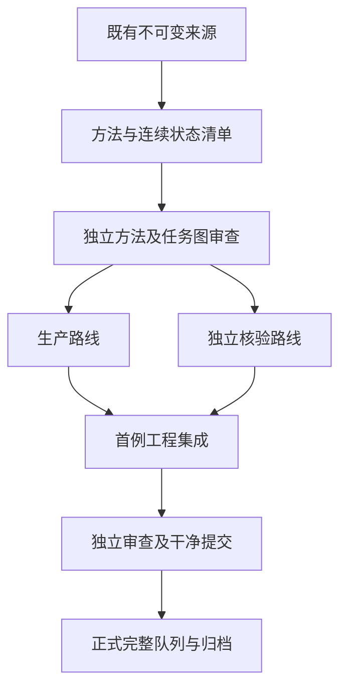

# 技术设计：既定北向前缀后的方向控制撤除

## 概述

Study047先只证明28个043北向终态可无物理重放续接。协议在任何未来抽签前固定33–64及两臂；后续实现才运行新物理。估计条件固定队列的撤除−继续差，不把旧control当本研究对照。

## 边界承诺

本规格拥有047方法来源/状态清单、两路线未来续接、工程与正式验收。允许只读依赖019/023原环境、038编码模板、043北向终态和046完成来源链。所有旧源/报告/规格保持不变，不新增世界、seed，不恢复初始创始成员或重复移除，不改变物理、交换关闭、供能、程序、完整组件或持续10标准。环境版本、源hash、模板、方向语义、窗口、观察合同变化都须重新方法审查；已经看过未来后不能伪装为原预注册修改。

## 架构及流程

使用现有Python标准库和既有物理/独立字典物理实现；无新增依赖。实际运行时版本与随机库字节由方法结果绑定。仓库未提供默认product/tech/structure steering，沿AGENTS及已完成研究规则，不自创全局策略。

## 文件结构计划

| 边界 | 新文件或产物 | 唯一职责 |
| --- | --- | --- |
| Method | `.kiro/specs/middle-policy-withdrawal/{spec.json,requirements.md,design.md,tasks.md,research.md}` | 规格、需求映射及任务图 |
| Method | `experiments/v4/study-047.md` | 科学预注册唯一详细合同 |
| Method | `docs/design/v4-middle-policy-withdrawal.zh-CN.md` | 续接与环境实现接口 |
| Method | `scripts/audit_v4_middle_withdrawal_design.py` | 标准库只读来源/结构清单，无物理入口 |
| Method | `docs/research/results/v4-study-047-design-{sources,census}.json` | 独占前后绑定与结构/RNG32状态 |
| Method | `docs/research/v4-study-047-method.zh-CN.md` | 方法实际证据和限制 |
| Producer | `scripts/middle_withdrawal_inputs.py`, `scripts/run_v4_middle_withdrawal.py`, `tests/test_v4_middle_withdrawal.py` | 来源契约、生产和相关边界测试 |
| Verifier | `scripts/verify_v4_middle_withdrawal.py`, `tests/test_v4_middle_withdrawal_verifier.py` | 独立环境/字典物理/观察和核验测试 |
| EngineeringIntegration | `docs/research/results/v4-study-047-engineering/`, `docs/research/v4-study-047-engineering.zh-CN.md` | 首例两路线和实际集成证据 |
| FormalIntegration | `data/v4-study-047/`, `docs/research/results/v4-study-047-formal/`, `docs/research/v4-study-047-results.zh-CN.md` | 完整正式两路线、归档与结果 |

审查文件由独立审查者创建；父层维护LOG与状态。源码与旧报告不修改；047新文件在各自边界内演进，方法结果一经绑定不覆盖。

## 组件、接口与需求追踪

| 组件 | 输入/输出合同 | 需求 |
| --- | --- | --- |
| Method | 046验证闭包、043完整arm、019两种模式过去32票→前后hash、100索引、28状态引用、20个RNG32状态 | 1.1, 1.2, 1.3, 2.2, 2.3, 4.2 |
| Producer | 方法核验状态+原模板→两臂32完整物理/观察及配对统计 | 2.1, 2.2, 3.1, 3.2, 3.3, 3.4 |
| Verifier | 同不可变源独立重建环境、身份、字典物理、组件/完整程序和统计→逐对象严格核验 | 1.1, 2.1, 2.2, 3.1, 3.2, 3.3, 4.2 |
| EngineeringIntegration | E120005两臂32步/路线+边界/异常/回归→工程证据与独立审查 | 4.1, 4.2, 4.3 |
| FormalIntegration | 干净工程提交→全28对、五格/14seed分组、完整归档与审查 | 1.2, 2.3, 3.4, 4.1, 4.3 |

## 数据和连续状态合同

`BoundaryState`包含encoding、seed、原t0/selection、043源字节hash与`/ablation/final`规范化hash、tick32 units/raw/site_ids/parents/individuals、原source.initial引用、旧removals/export引用。活着由site_ids唯一判定；parents=individuals.parent且父ID严格较小。所有存活单位程序/材料与individuals一致，能量/raw取最后真实末态，质量7。方法只重建保存事件的被动身份账，不调用step、physical_step或任何未来观察。

`EnvironmentBoundary`保存原命名空间/种子推导、方向/供能流32后完整state、其规范化hash、640过去生成器tick全部32票一致性、运行时与库hash。将20个旧seed全核验保留，科学纳入14seed由既定28案例唯一确定。原源路径north取023、其余环境根取019，east/west的实际编码态取038；同seed跨encoding票相同。

生产恢复Observer时直接设tick=32、alive、individuals、founders=3并独立深拷贝两臂；不能调用Observer(final.units)导致身份重编号。若用初始化后覆盖，须完整覆盖这四字段并验证。next_id=len(individuals)。旧创始移除记录不改death_tick，不再次回收材料或扣能。恢复边界无需物理前缀，核验可消费过去保存事件验证observer结构。

每未来环境tick对direction流作256次randrange(4)及feed流sample(range(256),4)，但实际提议保持固定四位置8、突变票固定[999,0,1]。自然票按seed缓存不可变值供所有编码/两arm，禁止按arm或编码额外推进共享生成器。continue_north只覆盖101/102为3，withdraw_to_natural全部原票。

`ArmResult`保留boundary、32 rows、final、all_new完整副本数、future指标、原t0出生见证与after32出生见证、未来区间/边界删失/cross_boundary。`PairedRecord`固定delta=withdraw_to_natural−continue_north。`Index`有100条原索引和触发元数据；72条future=null/N/A，不作为未来失败。细节和预算见[预注册协议](../../../experiments/v4/study-047.md)。

## 指标和完整账

以原模板的全程序、材料、整个连接组件、原0/1祖系且非0/1匹配all_new；q>=2连续10个33–64末态为主指标。世界级区间不要求成员ID不变，故所有成员/出生见证同时保留。q32仅诊断，跨界长度单列，不借过去天数满足future_persistent10。出生birth_tick>原t0与>32两种条件独立标记。旧summarize_arm以arm.initial.tick为出生阈值，047 initial=32时不得直接复用造成旧形成支持定义漂移；新适配显式传原t0及32两个阈值，测试包含原t0<birth_tick<=32且未来仍在场的反例，不修改旧函数。

未来能量、质量、人口从32边界核算；旧export仅前缀证据，047 export=0。完整事件、提议全部门槛/失败、供能接受拒绝、各项实际支出、原料、死亡/出生和组件祖系账全保留。主配对差/四格以28为条件分母，五编码包括S零格、零分母均值null；14seed中列出共享环境的编码，不当28独立重复。

## 失败、预算与测试策略

方法先独占sources文件并保存running；无论主工作或收尾异常均留失败、前后输入hash/读取错误、当前进度和已产物hash，保留首异常并原样传播。完成要求所有检查/收尾/预算成功；严格递归具体类型，不允许0=False或8=8.0蒙混。源路径限定仓库只读，结果目录不得覆盖。运行前检查047进程/目录；已存在输出只读调查并续接，不重新模拟。

方法600秒/128MiB，只有清单、py_compile、差异/空白与独立来源审查，不运行无关物理fixture suite。实现测试从需求导出：1.1身份连续/移除旁账/新ID；2.1同seed同自然票/两臂独立/只改两票；2.2错seed/消费序/运行时/过去票拒绝；3.1完整程序与组件/实际双副本；3.2仅32/33、跨界9+1与未来10、终点64和出生边界；3.3能量/材料/自然死亡与旧移除；4.2类型错配、输入变化、各阶段异常及KeyboardInterrupt/SystemExit失败保全。全部测试和实际物理执行的步数分别统计，不用mock计数冒充真实研究。

工程固定64新+64独立步，正式完整1792+1792；工程/正式两个epoch共3712真实计划步，工程不作为额外科学样本，也不充正式首例。实际方法阶段仍0。工程独立审查和干净提交之前不得正式运行；每路线600秒/128MiB。完整case以compact JSON保存，索引/汇总不重复嵌入轨迹；工程实测存储并验证全队列预算，超限保留失败，不删科学字段或减队列。正式归档保留各自原字节，完整对象严格比较后逐字节恢复并独立审查。
