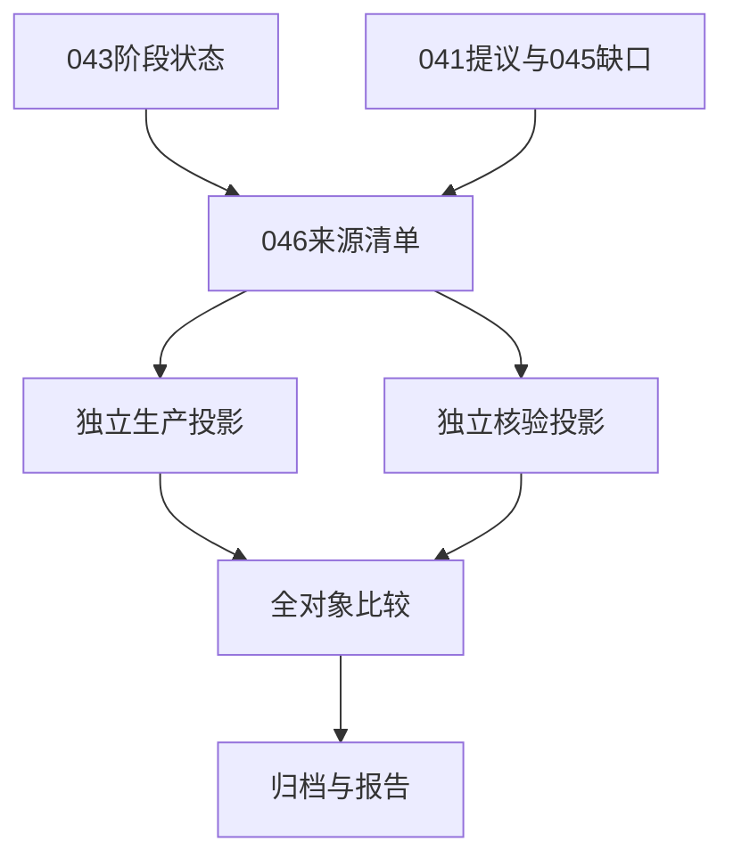

# 技术设计

## 概览

在现有JSON证据链上增加中行邻源槽位与045缺口引用，沿用标准库只读批处理，无新依赖。协议细节以experiments/v4/study-046.md为规范。

## 目标与非目标

完整观察实际补入机会和门槛，不做反事实转向、不新增模拟、不重算既有能量账/组件/生命史。只读来源与追加独占输出，不修改旧脚本或数据。

## 边界承诺

- Boundary Commitments：046拥有方法/来源引用清单、新槽位分类、目标阶段投影及既有缺口连接和汇总。
- Out of Boundary：041完整提议重新分类，042能量资格账，044组件重建，045区间重算；物理内核、政策、生命标准与外部发布。
- Allowed Dependencies：045完成metadata/proof/review/字节归档及输入清单；043保存分支；041完成提议与039旧分支；标准库。两正式路线只共享输入工具和不可变041值，核验器不能导入生产科学函数。
- Revalidation Triggers：来源hash/阶段字段改变、041复用对象不等、门槛顺序或间隙端点语义改变时停止并重新方法审查，不能静默补算或扩窗。

## 架构

## 文件结构计划

|文件|职责|阶段|
|---|---|---|
|experiments/v4/study-046.md|固定科学范围及计数口径|1|
|docs/design/v4-middle-refill-opportunities.zh-CN.md|方法摘要及进入正式阶段的条件|1|
|scripts/audit_v4_middle_refill_design.py|完成来源验证、041与045引用/结构清单|1|
|docs/research/results/v4-study-046-design-sources.json|全来源前后绑定|1|
|docs/research/results/v4-study-046-design-census.json|56arm/116复用row/226gap引用及预算|1|
|docs/research/v4-study-046-method.zh-CN.md|清单结果和执行限制|1|
|docs/research/results/v4-study-046-design-review.json|独立方法/清单/报告审查|1|
|scripts/middle_refill_inputs.py|正式不可变输入绑定|2–3|
|scripts/analyze_v4_middle_refill.py|生产槽位/目标/缺口汇总|2–3|
|scripts/verify_v4_middle_refill.py|独立阶段和索引算法核验|2–3|
|tests/test_v4_middle_refill.py、tests/test_v4_middle_refill_verifier.py|有意义的边界及失败测试|2–3|
|docs/research/results/v4-study-046-engineering/及engineering-review.json|首例及独立工程证据|2.3|
|data/v4-study-046/、docs/research/results/v4-study-046-*.json|正式独占产物和逐字节归档|3|
|docs/research/v4-study-046-results.zh-CN.md|正式全部阴性/局限/后续|3|

## 需求追踪

|需求|组件/契约|完成证据|
|---|---|---|
|1.1, 1.2|来源清单、精确复用|完整045/041证明，全部映射引用|
|2.1, 2.2|槽位与目标投影|6240槽位/1560目标tick及独立对象一致|
|3.1|gap引用连接|226既有区间、成功端点/删失不丢失|
|3.2|汇总|20格/28配对/全分母/零项|
|4.1|双入口/预算/归档|首工程、全suite、干净提交及独立核验|

## 组件与接口

来源审计器仅验证输入、计数结构和建立引用；045工程历史/tmp源路径只作原出处，稳定证据取已归档archive路径及hash/bytes，历史工程源码hash不要求等于当前源码。保存失败诊断、开始和结束hash，600秒/128MiB独占方法结果，不运行科学分类。审查可独立枚举几何邻格、045缺口决策tick和041案例/row指针，不调用清单生成函数。

正式生产与核验的概念接口分别是`project_pair(encoding, branch043, gaps045, reused041)`和另一独立同契约实现；输出每arm的诊断引用、全tick目标记录、八槽位行、缺口连接、源引用。身份键为encoding/seed/arm/identity，槽位键加tick/source/target，gap键为045 JSON指针。数值字段为整数或明确null，方向0..3，八状态用固定枚举；新生、消解和其他区域不可丢失。

041已有真实事件值原样复用并附引用；新增槽位状态、空/消解票及缺口连接标清新投影。其他48arm只补相同契约所需字段；不扩为完整世界的全提议路线或全能量账。目标竞争包括四邻源全部真实合格候选，不按祖系筛选。

## 数据模型与端点

SourceRef={path,file_sha256,json_pointer,normalized_sha256}；ArmPlan保存043来源、t0、rows预算、旧041引用或null；GapPlan引用原gap并追加decision_ticks，原empty_ticks保持不动。保留100索引和56诊断引用，不生成诊断槽位。

正式SlotObservation保存源前态ID、interaction能量、票及ticket_target、真实proposal_target或null、八状态、真实proposal或null及来源模式。TargetObservation保存三个阶段、4槽位键、候选/出生和原045行引用。GapObservation只连接原GapPlan窗口的目标/槽位键并汇总，不改变原时长、删失和边界。完整字段和优先级见协议，尤其补入b纳入决策窗而不计空末态。

## 错误与验证

输入缺失/坏hash、复用不一致、预算超限、重复输出立即失败，已有文件不覆盖；失败记录实际完成计数、已捕获来源及收尾hash/错误。完整正式队列不能先预跑后称工程。

边界测试覆盖空源同tick新生、消解票、不同目标方向、低能但目标有其他候选、同tick目标消解产生raw、同时碰撞、真实births对象、同tick替换、起点/终点删失、成功端点、gap外行、零触发全20格、041拒绝错arm/指针、独占目录及故障留存。任务1只有来源/结构读取，做py_compile、独立结构枚举和diff检查；不重复无关物理全suite。任务2.1生产与测试、2.2独立核验与测试、2.3首例集成/全suite/工程审查/干净提交；任务3才正式两路线核验和归档。
