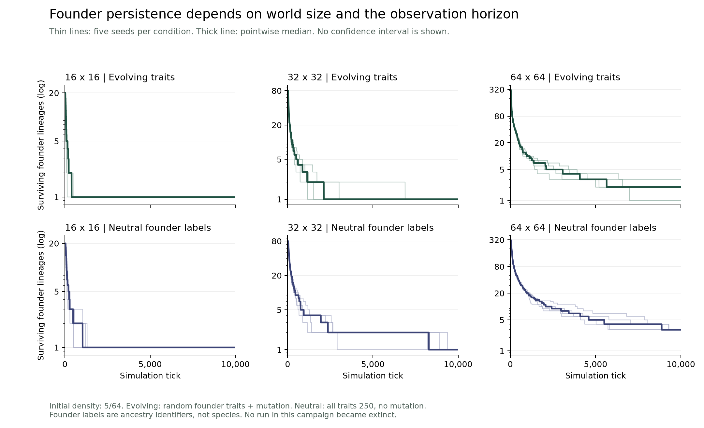

# Campaign 005 — Founder loss has a finite-world and finite-horizon component

Protocol: `experiments/v0/campaign-005.md`. Clean starting commit
`a6fd94c04cc085ab6d3beb00eb30e46ba6144cd3`, Python 3.12.10. Thirty runs,
10,000 ticks each; all invariants passed and no whole-world extinction occurred.
Raw outputs: `data/campaign-005/`. Compact results are committed in `results/`.

Initial density is 5/64 in every world. Evolving runs use random initial traits
and baseline mutation. Neutral controls set every founder to trait 250 and disable
mutation; labels have no phenotypic effect. Each row contains seeds 400–404.

| World | Treatment | Initial founders | Final population | Final founders | Reached one founder | First one-founder tick among those runs |
| --- | --- | ---: | ---: | ---: | ---: | ---: |
| 16×16 | Evolving | 20 | 11–36 | 1 | 5/5 | 132–482 |
| 16×16 | Neutral | 20 | 19–50 | 1 | 5/5 | 485–1,302 |
| 32×32 | Evolving | 80 | 65–95 | 1 | 5/5 | 1,164–6,891 |
| 32×32 | Neutral | 80 | 101–149 | 1 | 5/5 | 2,905–9,382 |
| 64×64 | Evolving | 320 | 284–319 | 1–3 | 1/5 | 6,981 |
| 64×64 | Neutral | 320 | 383–501 | 3 | 0/5 | Not reached |

Thin traces are individual seeds; thick traces are pointwise medians, not an
additional run. The vertical axes show counts on a logarithmic scale. No confidence
interval is plotted. All trajectories are nonzero, so the log axis hides no extinction.
PNG/SVG and an input/output hash sidecar are in `figures/`. Reproduce with the
optional analysis extra and `scripts/plot_v0_world_sizes.py`.

Larger worlds retained more founding labels at the observed endpoint. This does
not mean they retained a larger *fraction* of founders: the fractions are 5% in
16×16 worlds, 1.25% in 32×32 worlds, and 0.3125–0.9375% (evolving) or 0.9375%
(neutral) in 64×64 worlds. Starting label counts must be considered alongside
absolute remaining counts.

Neutral labels disappeared even though they encoded identical behavior. Thus a
single surviving founder, by itself, is not evidence of superior inherited strategy.
Evolving and neutral conditions differ in both trait dynamics and their resulting
population sizes; the difference between their loss times is not an isolated
estimate of selection strength.

The results qualify the earlier small-world lineage collapse: it is an observed
outcome at a declared scale and duration, not a claim that every larger world must
reach one lineage by the same time. Continued ancestry diversity does not establish
ecological species, new functions, or open-ended innovation. Five seeds per condition
also do not support a universal scaling law or an infinite-world extrapolation.
