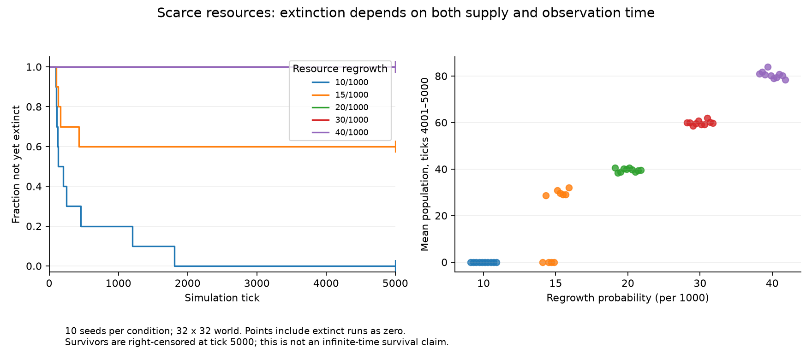

# Campaign 006 — Scarce resources and delayed extinction

Completed 50 runs / 250,000 ticks under unchanged `v0-darwin-1`, from clean
preregistered source `d692b09a80990d02642c76523cb1145f2dc01aa4`. Baseline 32×32,
80 founders, seeds 500–509, 5,000 ticks per run, five resource treatments.
Protocol: [campaign 006](../../experiments/v0/campaign-006.md).

| Regrowth per 1000 | Extinct by tick 5000 | Extinct-only tick range | Final population range | Group mean population, ticks 4001–5000 |
| --- | --- | --- | --- | --- |
| 10 | 10/10 | 93–1806 | 0–0 | 0 |
| 15 | 4/10 | 103–432 | 0–50 | 17.9301 |
| 20 | 0/10 | — | 28–59 | 39.5899 |
| 30 | 0/10 | — | 49–75 | 59.8804 |
| 40 | 0/10 | — | 61–112 | 80.5074 |

Each group mean includes every seed and extinct worlds as zero. Surviving runs
are right-censored at 5000: their extinction time is unknown, not 5000 or infinity.
The extinct-only ranges do not summarize the survival times of entire groups.



The survival curves for 20, 30 and 40 overlap at one throughout this horizon.
Right-panel horizontal offsets separate individual seeds and have no scientific
meaning. These are empirical ten-seed results, not confidence intervals.

## What changed in our understanding

Campaign 004's five low-resource runs died at ticks 83–136. The new independent
seed block includes extinction at 1201 and 1806 under the same 10/1000 condition.
The earlier short time range was seed-specific. An animation lasting 1000 ticks
would have shown two of these ten doomed populations still alive.

At 15/1000, outcomes mix early extinction and persistence through the observation
window. At 20/1000 and above none of these ten runs went extinct. This motivates
studying establishment and demographic fluctuations; it does not identify an
infinite-time critical threshold or prove that the surviving populations persist
forever. Initial food/energy, world size and evolving traits are held at baseline,
and would matter to any generalization. No mechanism separating adaptation from
chance establishment was isolated in this campaign.

## Verification and reproduction

All engine invariants were checked each tick. The plotting helper independently
read 250,050 metric rows and checked complete tick sequences, population/energy
accounting, absence of population reappearance after extinction, and extinction,
censoring, final population and late mean against saved JSON summaries. It does
not replay dynamics or validate lifecycle records, which this assay does not save.

All seed summaries are tracked in [campaign-006.csv](results/campaign-006.csv).
Raw data are local in `data/campaign-006/`. Reproduce with the preregistered helper
and a new output directory. Install the optional analysis extra to render figures:

```sh
python -m pip install -e ".[analysis]"
python scripts/plot_v0_extinction.py --input data/campaign-006 --output data/extinction-figure
```

The figure sidecar records hashes of input files, plotting code and outputs, plus
the Matplotlib version. The PNG was inspected for legibility. Earlier five-campaign
review pages and bundles remain historical snapshots and do not include this sixth
campaign. Total formal experiments now: 290 runs / 1,240,000 ticks.
