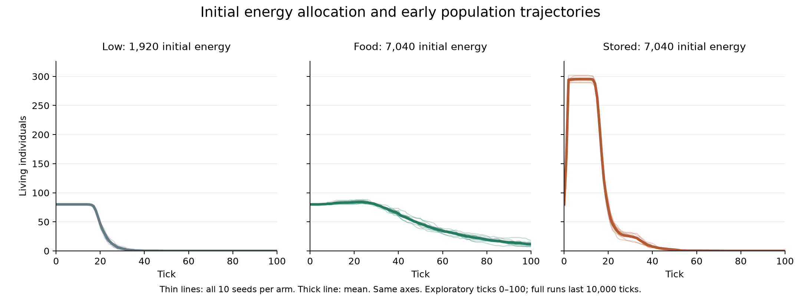

# Campaign 009 — Equal starting energy does not imply equal establishment

Thirty preregistered runs / 300,000 ticks completed from clean source
`0639fd66271db72068733fba5bf105769c444dac`. All use fixed genome 250, no mutation,
regrowth 15/1000, 32×32 cells, 80 founders and seeds 800–809 for 10000 ticks.
See [protocol](../../experiments/v0/campaign-009.md) and [all outcomes](results/campaign-009.csv).

| Treatment | Initial food/cell | Initial energy/founder | Initial total | Alive 500 / 5000 / 10000 | Extinct-only tick range |
| --- | ---: | ---: | ---: | --- | --- |
| low | 0 | 24 | 1920 | 0 / 0 / 0 of 10 | 32–49 |
| food | 5 | 24 | 7040 | 9 / 3 / 1 of 10 | 218–8398 |
| stored | 0 | 88 | 7040 | 0 / 0 / 0 of 10 | 51–73 |

| Treatment | Mean births | Mean total supplied energy at 10000 | Mean population, ticks 9001–10000 |
| --- | ---: | ---: | ---: |
| low | 0 | 26779.6 | 0 |
| food | 2733.4 | 199383.2 | 3.8864 |
| stored | 215.4 | 32315.2 | 0 |

All means include extinction zeros and every seed. The one surviving food world
(seed 801) ends with 36 individuals and is right-censored at 10000.

## Interpretation

The equal-energy arms differ strongly in early establishment within this seed
block. Initial energy total alone is insufficient to describe these outcomes:
energy in organisms and distributed environmental food have different consequences
under the existing feeding and reproduction rules. Giving founders more energy
produces births but does not maintain these ten populations to tick 500.

This is an allocation intervention, not a clean isolation of spatial position.
Higher founder energy crosses the reproduction threshold sooner, changes offspring
numbers and energy division, and changes subsequent competition. These results
are consistent with an early reproduction/maintenance burden, but that mechanism
has not been isolated by a counterfactual or an event-level energy decomposition.
No reproduction rule was changed to force the result.

Equal initial totals do not imply equal total input over time. Regrowth is capped
by local food capacity; extinct worlds eventually stop consuming food and reject
more proposed input. Consequently the supplied-energy difference is partly an
outcome of the trajectories, not an independently assigned sustained subsidy.
Same-seed initialization matches, but later environmental random draws can diverge.

Ten seeds are descriptive, not proof that stored energy always fails. Food also
does not ensure maintenance: only one of ten remains at 10000. Comparison with
campaign 008's food level 8 uses a different seed block and is not a paired dose
response test. No new trait, controller, life origin or open-ended evolution is claimed.

## Verification

### Exploratory early-window accounting

After seeing the extinction results, we examined ticks 1–100. This is a
post-experiment window, not an additional preregistered endpoint or campaign.
All ten seeds per arm remain included. Values below are group means of per-world
quantities; peak time is the mean of each world's first maximum, not the peak of
an averaged population curve.



Thin lines show individual worlds and thick lines show arm means. The low arm
has less initial energy; only food and stored are equal-energy treatments.
The figure covers the exploratory early window, not the full survival horizon.
[Vector figure](figures/campaign-009-early.svg) and
[input hashes](figures/campaign-009-early.json) are available. Regenerate with
`python scripts/plot_v0_energy_allocation.py --output data/new-allocation-figure`
after installing the optional analysis dependencies (`pip install -e ".[analysis]"`).

| Quantity, first 100 ticks | low | food | stored |
| --- | ---: | ---: | ---: |
| Maximum population (including tick 0) | 80 | 84.7 | 295.4 |
| First tick of maximum | 0 | 20.4 | 3.9 |
| Births by tick 10 | 0 | 1.4 | 215.4 |
| Births by tick 100 | 0 | 13.8 | 215.4 |
| Basal energy spent | 1776.9 | 4996.2 | 5551.9 |
| Movement energy spent | 426.7 | 1248.4 | 1325.7 |
| Reproduction energy spent | 0 | 55.2 | 861.6 |
| New supplied energy | 6182.4 | 6164.2 | 6195.2 |
| Population at tick 100 | 0 | 11.5 | 0 |
| Food energy remaining at tick 100 | 5898.8 | 6726 | 5496 |

The stored arm shows an early population expansion followed by extinction while
food remains in the world. Aggregate world-energy exhaustion is therefore not a
sufficient description. This does not establish whether any dying individual had
nearby usable food: per-tick totals lack that spatial history. The accounting does
not isolate a causal effect of birth cost, energy splitting or population size.

Basal cost is exactly one per individual alive before a tick, so it can be
reconstructed by summing pre-tick populations. Reproduction cost is four times new
births; movement is residual dissipation. These are exact integer decompositions
per run under the unchanged rules, using the previously tested
[budget identity](energy-budget.md). Initial stock plus new input equals costs
plus final food/organism stock. New input here excludes the initial endowment.

```sh
python scripts/analyze_v0_establishment_budget.py --output data/new-early-budget
```

[All-seed budgets](results/early-budget-009.csv) and the
[hash/summary sidecar](results/early-budget-009.json) preserve the analysis.
The script reads complete metric tables, checks accounting, and reuses the budget
helper; no worlds were rerun. Three existing budget contract tests passed.

### Original run verification

Every simulated tick checked engine invariants. A separate helper checked all
300,030 metric rows: fixed protocol and complete grid, initial energy components,
tick sequence, population/energy accounting, fixed trait, persistent extinction,
intermediate and final outcomes, late means and saved JSON summaries. The helper
does not replay dynamics or audit unexported lifecycle logs.

```sh
python scripts/summarize_v0_energy_allocation.py --input data/campaign-009 --output data/new-energy-allocation-summary
```

[Verification metadata](results/campaign-009-verification.json) records all CSV
hashes and helper hash. Preregistered source passed six-environment CI run
34778593278. Formal totals are now **400 runs / 2,040,000 ticks in nine campaigns**.
Existing eight-campaign visual pages and archives retain their declared scope.
