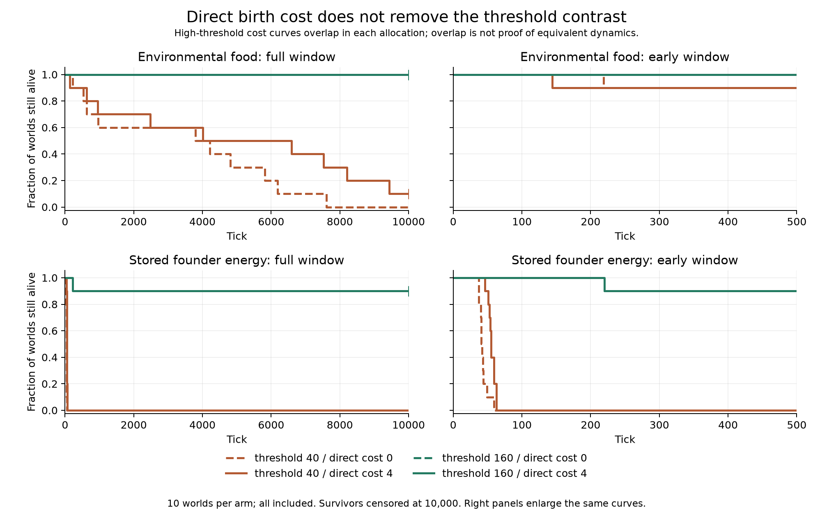

# Campaign 012: direct birth cost does not explain early failure alone

Protocol: [campaign 012](../../experiments/v0/campaign-012.md). Source
`b963348dc346969fb688d9d8c12235524c9d1493`, clean at launch. Eight arms,
seeds 1000–1009, 10000 ticks each: 80 executions / 800000 ticks.
Unchanged V0 rules; fixed movement trait 250 and mutation off. Both initial
allocations have total energy 7040. This is a parameter intervention, not evolution.

## Results

All denominators are ten worlds. Late means include extinct worlds as zeros.
Extinction ranges include failures only; survivors are censored at 10000.

| Allocation / threshold / cost | Alive 500 | Alive 5000 | Alive 10000 | Extinction ticks | Mean births by 100 | Mean early peak | Late mean population |
| --- | ---: | ---: | ---: | --- | ---: | ---: | ---: |
| food-40-cost-0 | 9/10 | 3/10 | 0/10 | 219–7613 | 13.2 | 85.3 | 0.0000 |
| food-40-cost-4 | 9/10 | 5/10 | 1/10 | 144–9439 | 13.4 | 85.3 | 5.2975 |
| food-160-cost-0 | 10/10 | 10/10 | 10/10 | none | 0.0 | 80.0 | 41.3826 |
| food-160-cost-4 | 10/10 | 10/10 | 10/10 | none | 0.0 | 80.0 | 41.1479 |
| stored-40-cost-0 | 0/10 | 0/10 | 0/10 | 37–59 | 237.5 | 317.5 | 0.0000 |
| stored-40-cost-4 | 0/10 | 0/10 | 0/10 | 46–63 | 216.2 | 296.2 | 0.0000 |
| stored-160-cost-0 | 9/10 | 9/10 | 9/10 | 220–220 | 0.0 | 80.0 | 37.9981 |
| stored-160-cost-4 | 9/10 | 9/10 | 9/10 | 220–220 | 0.0 | 80.0 | 37.7632 |

The stored/40 worlds all fail with either cost. Cost zero produces a larger
early birth burst (237.5 versus 216.2 births by tick 100) and failures at 37–59
rather than 46–63. These observations do not establish which indirect mechanism
caused each death. Stored/160 retains nine worlds at each horizon for both costs;
seed 1007 dies at 220 in both. Food/160 retains all ten; food/40 retains zero
(cost 0) or one (cost 4) at 10000. Small observed differences are not estimates
of a universally optimal cost.



The high-threshold cost curves coincide within each allocation in this sample.
This is overlap in the survival observation, not equivalence of population or
energy trajectories. Dashed lines denote cost zero; solid lines cost four.
Colors denote threshold and rows denote allocation. Every seed is included;
endpoint markers indicate survivors whose later lifetime is unknown. Figure
construction checks the complete grid and horizon/extinction consistency in the
verified compact results. The [curve values and hashes](figures/campaign-012-survival.json)
are saved; the right-hand zoom adds no observations.

Rebuild with `python scripts/plot_v0_birth_cost.py --output data/my-birth-cost-figure`
after installing the optional analysis dependencies.

## Predeclared descriptive contrasts

Threshold contrast is survival fraction at 160 minus survival fraction at 40.
Difference of contrasts is that contrast at cost 0 minus the contrast at cost 4.
Values below are percentage points, not significance tests.

| Allocation | Horizon | Threshold contrast, cost 0 | Threshold contrast, cost 4 | Difference |
| --- | ---: | ---: | ---: | ---: |
| food | 500 | 10 | 10 | 0 |
| food | 5000 | 70 | 50 | 20 |
| food | 10000 | 100 | 90 | 10 |
| stored | 500 | 90 | 90 | 0 |
| stored | 5000 | 90 | 90 | 0 |
| stored | 10000 | 90 | 90 | 0 |

## Interpretation and verification

Positive direct birth deduction is not necessary for the observed low-threshold
stored-energy failure: it persists when that deduction is zero. Zero direct cost
still divides parental energy, creates another consumer and occupies space.
The threshold effect persists with either direct cost in this sample. This does
not isolate splitting, basal demand, movement or local access as the unique cause.
Both parameters act throughout life; random-number consumption and realized
resource input can diverge. No permanence, evolved strategy, sensory function or
biological generality follows from this assay.

All 800080 metric rows passed independent checks of the declared grid, fixed
parameters, initial ledger, tick sequence, accounting/bounds, fixed living trait,
extinction, terminal summaries, early peak and late turnover. Engine invariants
were checked during execution. Full events and genealogy were not exported.
Per-arm late births/deaths, every seed and input hashes are retained in
[results](results/campaign-012.csv) and [verification](results/campaign-012-verification.json).

Preregistered-source CI [34782507452](https://github.com/nikolasandwich/bitgenesis/actions/runs/34782507452)
and verifier CI [34782708374](https://github.com/nikolasandwich/bitgenesis/actions/runs/34782708374) passed.
These checks do not rerun all eighty worlds on the CI matrix.

```sh
python scripts/summarize_v0_birth_cost.py --input data/campaign-012 --output data/campaign-012-check
```

## Retrospective first-100-tick energy ledger

This window analysis was added after the registered outcomes were known. It adds
no new worlds or independent replicates. All eighty input hashes match the
verified metrics. With basal_cost=1, each pre-tick living organism pays exactly
one basal unit. Direct birth spending is actual treatment cost times births;
movement spending is total dissipation minus basal and direct birth spending.
The previously tested accounting helper is reused. Initial energy 7040 plus
new supply equals dissipation plus remaining organism/food energy.

All entries are means over ten worlds, summed over ticks 1–100.

| Arm | Basal | Movement | Direct birth | New supply | Organism energy at 100 | Food energy at 100 |
| --- | ---: | ---: | ---: | ---: | ---: | ---: |
| food-40-cost-0 | 5085.7 | 1242.7 | 0.0 | 6168.0 | 204.7 | 6674.9 |
| food-40-cost-4 | 5056.3 | 1231.1 | 53.6 | 6154.0 | 210.6 | 6642.4 |
| food-160-cost-0 | 4890.8 | 1209.1 | 0.0 | 6151.7 | 385.7 | 6706.1 |
| food-160-cost-4 | 4890.8 | 1209.1 | 0.0 | 6151.7 | 385.7 | 6706.1 |
| stored-40-cost-0 | 6262.9 | 1488.3 | 0.0 | 6196.0 | 0.0 | 5484.8 |
| stored-40-cost-4 | 5549.6 | 1316.0 | 864.8 | 6198.0 | 0.0 | 5507.6 |
| stored-160-cost-0 | 7368.7 | 1822.3 | 0.0 | 6193.6 | 549.0 | 3493.6 |
| stored-160-cost-4 | 7368.7 | 1822.3 | 0.0 | 6193.6 | 549.0 | 3493.6 |

In stored/40, removing the direct deduction saves 864.8 units in that category,
while basal plus movement rises by 885.6 units; total dissipation rises by 20.8.
The larger early birth burst accompanies this redistribution. This is observed
accounting, not a mediation estimate: changed numbers, lifetimes, trajectories
and RNG consumption can all contribute. Both groups are already extinct by 100
while substantial energy remains as food. World-wide food does not establish
local access for the organisms that died.

Stored/160 spends more cumulative basal/movement energy than stored/40 over this
window while retaining individuals. Duration alive contributes to cumulative
spending, so a larger total cannot itself be interpreted as harmful. No births
occur in the high-threshold arms before 100, and the two costs produce matching
early ledger means within each allocation; later results need not match.

[All-world budgets](results/early-budget-012.csv) and
[hashes and arm means](results/early-budget-012.json) preserve the calculation.

```sh
python scripts/analyze_v0_birth_cost_budget.py --output data/my-birth-cost-budget
```
