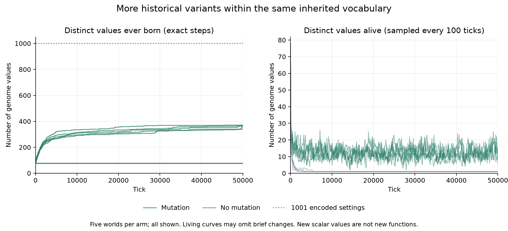

# Campaign 013: many births within a fixed genome vocabulary

Protocol: [campaign 013](../../experiments/v0/campaign-013.md). Clean execution
source `f3f35e5850b1a358dc7b9c94692d5f1686057e1d`. Five fresh seeds per arm,
50000 ticks each: ten executions / 500000 ticks. All ten worlds survived the
endpoint. These are new seeds, not extensions of campaign 001.

## Every world

| Arm | Seed | Initial values | Ever seen at 50000 | New in final 10000 | Living variants | Population | Max living generation |
| --- | ---: | ---: | ---: | ---: | ---: | ---: | ---: |
| mutation | 1100 | 78 | 371 | 2 | 12 | 67 | 1042 |
| mutation | 1101 | 77 | 340 | 0 | 5 | 60 | 1064 |
| mutation | 1102 | 77 | 366 | 7 | 9 | 75 | 1025 |
| mutation | 1103 | 78 | 365 | 12 | 11 | 74 | 1050 |
| mutation | 1104 | 77 | 355 | 22 | 16 | 92 | 1068 |
| no-mutation | 1100 | 78 | 78 | 0 | 1 | 83 | 1044 |
| no-mutation | 1101 | 77 | 77 | 0 | 1 | 72 | 1056 |
| no-mutation | 1102 | 77 | 77 | 0 | 1 | 68 | 1097 |
| no-mutation | 1103 | 78 | 78 | 0 | 1 | 73 | 1023 |
| no-mutation | 1104 | 77 | 77 | 0 | 1 | 86 | 1061 |

Every endpoint has one surviving founder lineage. Maximum living generation
is genealogical depth, not synchronized generations. No-mutation inheritance
was checked against each recorded parent, not merely against the initial pool.

## Predeclared coverage horizons

| Arm / seed | 0 | 1000 | 5000 | 10000 | 25000 | 40000 | 50000 |
| --- | ---: | ---: | ---: | ---: | ---: | ---: | ---: |
| mutation / 1100 | 78 | 190 | 320 | 336 | 363 | 369 | 371 |
| mutation / 1101 | 77 | 171 | 268 | 292 | 307 | 340 | 340 |
| mutation / 1102 | 77 | 181 | 267 | 315 | 341 | 359 | 366 |
| mutation / 1103 | 78 | 185 | 292 | 310 | 335 | 353 | 365 |
| mutation / 1104 | 77 | 186 | 280 | 295 | 319 | 333 | 355 |
| no-mutation / 1100 | 78 | 78 | 78 | 78 | 78 | 78 | 78 |
| no-mutation / 1101 | 77 | 77 | 77 | 77 | 77 | 77 | 77 |
| no-mutation / 1102 | 77 | 77 | 77 | 77 | 77 | 77 | 77 |
| no-mutation / 1103 | 78 | 78 | 78 | 78 | 78 | 78 | 78 |
| no-mutation / 1104 | 77 | 77 | 77 | 77 | 77 | 77 | 77 |

Mutation worlds reach 340–371 distinct values, including their founders, with
0–22 first appearances in the final ten thousand ticks. Four of five still add
values in that window; one does not. Neither a universal plateau nor perpetual
novelty follows. No-mutation worlds retain exactly their founding vocabulary
of 77–78 values while ending with a single living value each.

The genome-to-action mapping still contains only 1001 movement probabilities.
All these variants share the same random-direction movement, feeding and
reproduction machinery. A previously unseen number is variation within that
family, not a sensor, memory, new action or functional innovation. Large birth
counts and long genealogies do not enlarge the mapping. Conversely, this is not
a bound of 1001 on collective world states.



Left: exact cumulative change points from the verified per-tick metrics; right:
living diversity sampled every 100 ticks, which can omit brief fluctuations.
The panels have different vertical scales. All five worlds in each arm are
shown, with overlapping controls retained. The dotted bound applies to encoded
movement settings, not all possible world states. Curve data, sampling interval
and source hashes are saved in the [figure record](figures/campaign-013-coverage.json).
No fitted plateau or extrapolation is shown.

```sh
python scripts/plot_v0_genome_coverage.py --output data/my-coverage-figure
```

Install the optional analysis dependencies to regenerate the PNG/SVG.

## Verification and limits

Independently checked 744901 birth records and 500010 metric rows. Reconstructed
first appearance and every-tick cumulative coverage; checked contiguous IDs,
parent-before-child order and timing, mutation bounds/no-mutation inheritance,
energy/population accounts, initial state, fixed protocol and all declared
coverage/endpoint summaries. All ten runs and all observation horizons remain
in [compact results](results/campaign-013.csv) and the
[verification report](results/campaign-013-verification.json).

Full death records and spatial replay were not exported. Living diversity and
genealogical depth receive metric bounds/consistency checks, not independent
reconstruction of the surviving individual set. Raw birth tables do not establish
parent survival at the instant of a child birth. Runtime invariants and the
unchanged engine add evidence, but are distinct from offline checks.

Five seeds per arm and a finite endpoint do not establish permanence or a
universal novelty rate. Shared seeds match initialization, not subsequent random
environmental draws after trajectories diverge. No formal significance test or
functional-adaptation claim is made.

Preregistered source CI [34784159894](https://github.com/nikolasandwich/bitgenesis/actions/runs/34784159894)
and verifier-test CI [34784386963](https://github.com/nikolasandwich/bitgenesis/actions/runs/34784386963) passed.
The latter has 64 tests; it does not rerun this full campaign across the CI matrix.

```sh
python scripts/summarize_v0_genome_coverage.py --output data/my-genome-coverage-check
```
