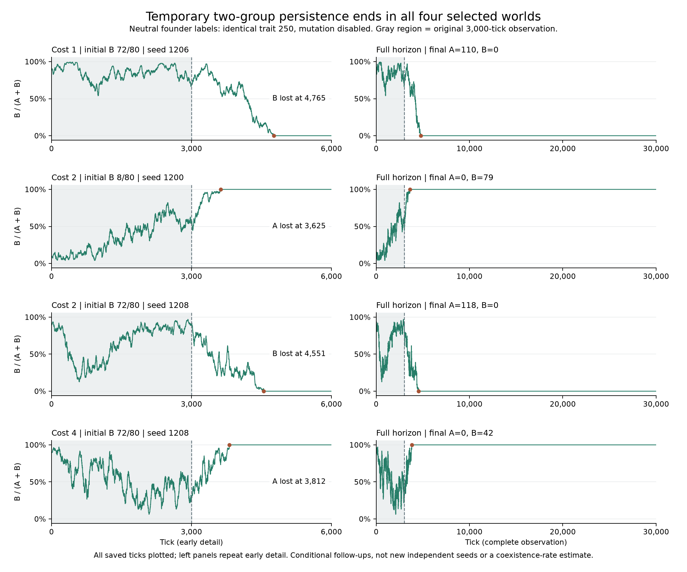

# Campaign 015 — Follow-up of neutral two-group endpoints

All four neutral worlds with both labels present at tick 3,000 in campaign 014
lost one group by tick 4,765. The remaining group survived through tick 30,000.
The earlier endpoints were not evidence of stable coexistence.

| Movement cost | Initial B | Seed | A/B at 3,000 | First group loss | A/B at 30,000 |
| --- | ---: | ---: | --- | --- | --- |
| 1 | 72 | 1206 | 38/85 | B at 4,765 | 110/0 |
| 2 | 8 | 1200 | 38/50 | A at 3,625 | 0/79 |
| 2 | 72 | 1208 | 7/67 | B at 4,551 | 118/0 |
| 4 | 72 | 1208 | 29/11 | A at 3,812 | 0/42 |

All four also had just one group at tick 10,000. No world became extinct.
At the final endpoint each world had one founder lineage and one genome value.
A and B are inherited founder labels with the identical fixed movement trait
250 and mutation disabled; they are not species or different functions.

## Complete trajectories



Each row is one selected world. The left panel repeats ticks 0–6,000 in detail;
the right panel includes all 30,001 recorded states through tick 30,000. Gray
shading identifies the original observation window; the dot marks first group
loss. All y-axes show the B fraction, not population size. A flat line at 0% or
100% means a single surviving label; it does not imply no births, deaths or
population fluctuation. Labels share the same trait throughout.

[Vector figure](figures/campaign-015-followup.svg) ·
[Plot provenance](figures/campaign-015-followup.json).
Rebuild with `python scripts/plot_v0_neutral_followup.py --output data/new-followup-figure`.
The plotting script checks raw hashes against the independent audit and verifies
observation snapshots and loss annotations. Matplotlib is an optional plotting
dependency; the engine and record verifier do not require it.

## Design and limits

The [protocol](../../experiments/v0/campaign-015.md) selected **every** qualifying
neutral endpoint before follow-up. Four executions ran the full 30,000 ticks:
120,000 computed ticks, including 12,000 replayed prefix ticks and 108,000
additional observation ticks. These are selected existing worlds, not four
new independent seeds. Seed 1208 occurs in two different conditions. Selection
on prior survival makes this an unbalanced conditional cohort; the four cases
cannot estimate an unconditional coexistence rate or a frequency effect.

The outcomes show loss within these particular finite trajectories. They do
not establish inevitable fixation for every possible world, a critical movement
cost, ecological coexistence, rare invasion, or open-ended evolution.

## Verification and reproduction

Clean execution source: `b5750541063ee8f5e68be0a8964552e95798f6ea`;
rules `v0-darwin-1`, Python 3.12.10. The engine was unchanged.

The independent record verifier checked all **120,004 metric rows** for group,
trait, population, founder and energy consistency, transition bounds and no
reappearance of lost groups. It reconstructed first losses, final outcomes and
all three observation snapshots. All **12,004 prefix rows**, including tick zero,
equal the campaign-014 records exactly; reference hashes equal the prior audit.
This checks recorded consistency, not a full individual/spatial history, which
was not retained. Hashes identify inputs; they are not external authentication.

```sh
python scripts/run_v0_neutral_followup.py --output data/campaign-015-new
python scripts/summarize_v0_neutral_followup.py --input data/campaign-015-new --output data/campaign-015-new-analysis
```

Requires the original campaign-014 raw CSVs under `data/campaign-014` (available
in the fourteen-campaign archive) and an installed local package. Output
directories must be new. The verifier uses only the standard library plus its
sibling verification script. The fifteen-campaign results postdate that archive.

[Compact records](results/campaign-015.csv) ·
[Verification and hashes](results/campaign-015-verification.json)

## Retrospective supplement: one label, continuing turnover

The horizontal fraction lines conceal substantial demographic activity. Using
all four audited trajectories, the common window counts events at ticks
5,001–30,000 and population states at ticks 5,000–30,000:

| Cost | Initial B | Seed | Births | Deaths | Population start → end | Population range |
| --- | ---: | ---: | ---: | ---: | --- | --- |
| 1 | 72 | 1206 | 46,148 | 46,148 | 110 → 110 | 66–173 |
| 2 | 8 | 1200 | 44,233 | 44,270 | 116 → 79 | 42–153 |
| 2 | 72 | 1208 | 44,097 | 44,054 | 75 → 118 | 33–172 |
| 4 | 72 | 1208 | 33,623 | 33,617 | 36 → 42 | 5–121 |

Each retains exactly one founder lineage and one genome value throughout this
window. In the first case, equal endpoint populations and equal total births and
deaths coexist with large intermediate fluctuations. Neither equality establishes
a stationary distribution or ecological equilibrium. Continued birth and death
here are demographic turnover, not new inherited traits or functional innovation.

The [complete table](results/neutral-turnover-015.csv) also includes each world's
own post-loss window, excluding events on the loss tick itself. Those windows
have unequal lengths and overlap the common late window; they are not eight
independent observations. This is retrospective descriptive analysis of a selected
cohort, with no new simulation and no causal test of movement cost.

Reproduce with `python scripts/analyze_v0_neutral_turnover.py --output data/new-turnover`.
The standard-library script checks raw hashes against the prior audit, retained
label absence and population/birth/death accounting. [Provenance](results/neutral-turnover-015.json)
identifies the inputs and script. This supplement postdates the fixed
fifteen-campaign archive; that archive contains the raw data needed to recompute it.
