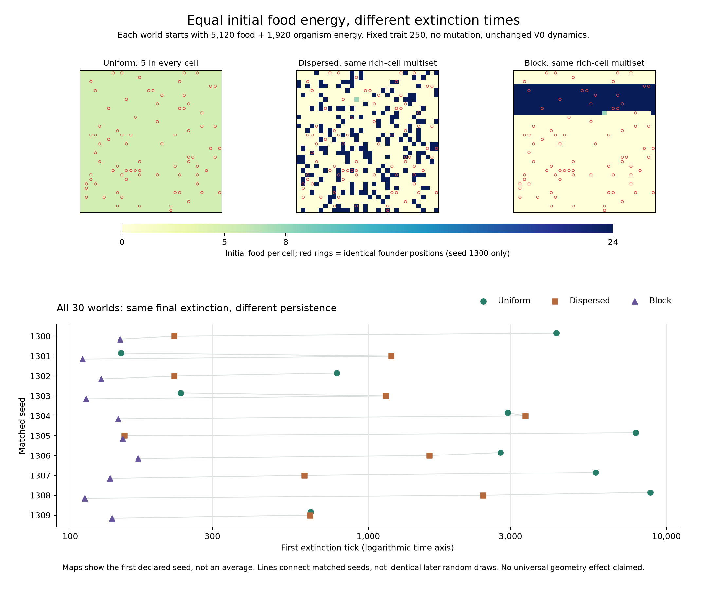

# Campaign 016 — Equal initial food energy, different spatial arrangements

All thirty worlds were extinct by tick 10,000, but their earlier survival differs.
The block arm lost every world by tick 169; dispersed and uniform maps retained
seven and eight worlds, respectively, at tick 500. Endpoint extinction alone
would conceal these establishment and persistence differences.

| Initial map | Worlds | Alive at 500 | Alive at 5,000 | Alive at 10,000 | Extinction ticks |
| --- | ---: | ---: | ---: | ---: | --- |
| Uniform | 10 | 8 | 3 | 0 | 148–8,845 |
| Dispersed | 10 | 7 | 0 | 0 | 152–3,362 |
| Block | 10 | 0 | 0 | 0 | 110–169 |

The block world died earlier than its dispersed counterpart in all ten seed
pairs. This is descriptive evidence in the declared seed block and settings,
not a claim that concentration always harms survival or a test of evolved sensing.

## Initial maps and every seed's outcome



The maps show seed 1300, the first declared seed, with the same founder positions
in red rings; they are an illustration, not an average across layouts. One shared
color scale runs from zero to 24 food units. The lower panel includes all thirty
worlds, with a logarithmic time axis and a small vertical offset by treatment to
keep nearly equal outcomes visible. Gray lines group the same seed across arms;
they do not imply matched later random draws or temporal interpolation.

[Vector figure](figures/campaign-016-geometry.svg) ·
[Figure provenance](figures/campaign-016-geometry.json).
Rebuild using `python scripts/plot_v0_food_geometry.py --output data/new-geometry-figure`.
The script checks the complete outcome grid and illustrative map hashes against
the independent audit. It uses the optional Matplotlib plotting dependency.

## What was controlled

The [preregistered protocol](../../experiments/v0/campaign-016.md) used ten new
seeds, 1300–1309, in each of three arms. Every run continued through tick 10,000,
including after extinction. Fixed movement trait 250, no mutation, regrowth
15/1000, 80 founders at energy 24; other baseline dynamics unchanged.

Every world starts with exactly 5,120 food energy and 1,920 organism energy.
Uniform places five food units per cell. Dispersed and block both use 213 cells
at 24, one at eight, and 810 empty cells. The former permutes cell positions;
the latter translates a contiguous row-major block around the torus. Initial
food maps are explicit interventions after zero-food world construction and
before tick zero; the supplied-energy accounting includes the added food.

For each seed, founders and world RNG-state digests match across all three arms.
The layout generator is separate from the world generator. Thus the dispersed
versus block comparison changes arrangement while preserving initial food values,
founders and world random state. Later action paths, random draws and realized
resource replenishment can diverge. Their equality is not assumed.

Uniform versus either other arm changes both arrangement and local food amounts,
so it is not an arrangement-only contrast. Initial exposure beneath founders is
reported in the [all-run table](results/campaign-016.csv), but it was not separately
manipulated. This experiment does not identify it as the unique causal mechanism.
Ten matched seed triplets are not thirty independent seed samples.

## Verification

Clean execution source: `d56af66c02dcfdd288214b794a510b3116192ee7`, Python 3.12.10,
rules `v0-darwin-1`. The independent standard-library verifier reconstructs the
declared layouts and founding RNG draws without stepping the simulator. It checks
all thirty initial maps, exact founder records and ten matched seed triplets.

All **300,030 metric rows** pass population/energy accounting, fixed-trait and
founder bounds, per-tick transition bounds and no recovery after extinction.
All summary fields, observation counts, exposure measures and first extinction
ticks are reconstructed from saved inputs. [Verification and hashes](results/campaign-016-verification.json)
identify those inputs; this is not an independent dynamic replay or authentication.
Full individual death/movement histories and spatial replay were not retained.

```sh
python scripts/summarize_v0_food_geometry.py --input data/campaign-016 --output data/new-geometry-check
```

Three helper tests cover correct initial layouts/pairing, a wrong layout with
unchanged total energy, wrong RNG digest, truncated metrics and energy corruption.
The full local suite has 106 passing tests at this analysis checkpoint.

This campaign adds 30 executions / 300,000 computed ticks, with no historical
prefix replay. Formal totals are sixteen campaigns, 744 executions and 6,640,000
computed ticks. The fixed fifteen-campaign archive does not contain this campaign.

## Retrospective initial access analysis

Counting founders already on food does not by itself explain the paired outcome
ordering. In seven of ten block/dispersed pairs, the block map has **more**
founders standing on initial food; in one pair the counts are equal, and in two
it has fewer. The block world nevertheless goes extinct earlier in all ten pairs.
This does not rule out a contribution from immediate food exposure; multiple
features change together, and the comparison is retrospective.

Shortest cardinal distance to any positive initial food cell reveals a different
contrast. Distances wrap around the torus and ignore occupancy and later changes.
The ranges below are across ten worlds in each arm, not confidence intervals.

| Initial-map statistic | Uniform | Dispersed | Block |
| --- | ---: | ---: | ---: |
| Founders standing on food | 80 | 7–24 | 11–22 |
| Food energy directly beneath founders | 400 | 168–576 | 264–528 |
| Mean founder distance to nearest food (cells) | 0 | 1.025–1.3125 | 4.9875–6.5125 |
| Maximum founder distance (cells) | 0 | 3–4 | 13 |
| Founders within two cells of food | 80 | 72–77 | 19–29 |
| Founders within four cells of food | 80 | 80 | 28–43 |

Each world contributes 80 founder positions. All dispersed-arm founders are at
most four cells from some initial food; every block world has a founder thirteen
cells away. These are initial geometric distances, **not observed travel paths,
expected arrival times, or proof of starvation**. The organisms choose random
moves; occupancy, food depletion, regrowth, birth and energy use change access.
The saved initial maps and aggregate metrics do not identify which transfer or
interaction caused the population to collapse.

The analysis checks all thirty initial file hashes against the campaign verifier,
reconciles on-food counts and energy beneath founders, and retains every founder
distance histogram plus all thirty run summaries. Distance computation is tested
against an independent toroidal Manhattan-distance formula, including narrow
worlds. All 111 local tests pass at this checkpoint.

[All-run access table](results/food-access-016.csv) ·
[Histograms, paired counts and provenance](results/food-access-016.json).
Reproduce with standard-library Python:

```sh
python -I -S scripts/analyze_v0_food_access.py --output data/new-food-access
```

This adds no world executions. It postdates the fixed sixteen-campaign archive;
that archive retains the initial maps needed by this later script. A useful next
mechanism experiment would measure actual early food uptake and occupied-site
congestion, or manipulate spatial access while controlling initial exposure.
The present analysis motivates such a comparison rather than settling it.
