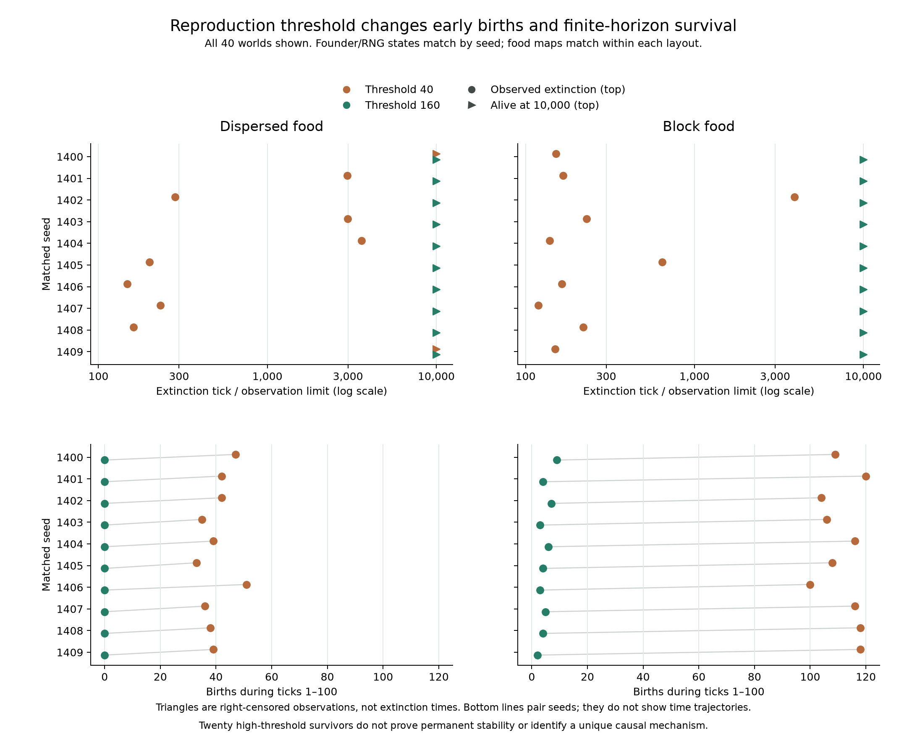

# Campaign 017 — Food layout and reproduction threshold

All twenty high-threshold worlds survived to tick 10,000. At the original
threshold, two dispersed worlds survived and no block world survived. Raising
the threshold also reduced early births and prevented the initial population
from exceeding its founder count in these twenty worlds.

| Food layout | Birth threshold | Alive at 500 | Alive at 5,000 | Alive at 10,000 | Extinction range among extinct worlds |
| --- | ---: | ---: | ---: | ---: | --- |
| Dispersed | 40 | 5/10 | 2/10 | 2/10 | 148–3,620 |
| Dispersed | 160 | 10/10 | 10/10 | 10/10 | None observed |
| Block | 40 | 2/10 | 0/10 | 0/10 | 119–3,903 |
| Block | 160 | 10/10 | 10/10 | 10/10 | None observed |

Within dispersed layouts, eight seed pairs changed from extinct at 10,000 under
threshold 40 to alive under 160, and two were alive under both. Within block
layouts all ten pairs changed from extinct to alive. These are endpoint paired
comparisons; right-censored high-threshold runs do not provide their eventual
extinction times. Twenty high-threshold executions are ten seed quadruplets,
not twenty independent seed blocks or evidence of permanent stability.

## All seeds in the comparison



Top panels retain all forty outcomes: circles are observed extinction times,
triangles are worlds still alive at the 10,000-tick observation limit. The time
axis is logarithmic; the triangles do not impute extinction at 10,000. Bottom
panels show the predeclared first-hundred-tick birth counts. Thin lines connect
the two thresholds for the same seed, not a trajectory through time. Small
vertical offsets separate overlapping points. Initial founders and RNG match by
seed, while food maps match only within each layout.

[Vector figure](figures/campaign-017-threshold.svg) ·
[Figure data and provenance](figures/campaign-017-threshold.json).
Rebuild with `python scripts/plot_v0_geometry_threshold.py --output data/new-threshold-figure`.
The optional Matplotlib dependency is required. The plot checks the complete
four-treatment grid and consistency of censoring with endpoint population before
rendering; it relies on the separately verified campaign records.

## Predeclared early observations

Ranges below are across ten worlds per treatment during ticks 0–100. Food uptake
covers ticks 1–100; population peaks include the initial 80 founders.

| Layout / threshold | Births by 100 | Peak population | Population at 100 | Food consumed by 100 |
| --- | ---: | ---: | ---: | ---: |
| Dispersed / 40 | 33–51 | 97–120 | 2–10 | 2,856–3,980 |
| Dispersed / 160 | 0 | 80 | 7–20 | 3,028–3,848 |
| Block / 40 | 100–120 | 116–157 | 1–15 | 5,484–6,164 |
| Block / 160 | 2–9 | 80 | 11–25 | 2,508–4,600 |

These windows and observations were fixed in the protocol before execution.
Higher threshold changes reproduction eligibility and timing, individual energy
storage, population size and subsequent interactions together. The experiment
therefore supports a threshold-dependent outcome in these settings, without
identifying birth cost, crowding or another mediator as the unique cause.
There is no evolved sensing or controller: all genomes remain fixed at 250.

The original-threshold block results also qualify campaign 016: that earlier
seed block went extinct by tick 169, whereas the new block seeds include
extinctions at 230, 645 and 3,903. Reported ranges belong to the sampled seeds;
the earlier range is not a bound on all V0 worlds. No old results were replaced.

## Controlled initialization and verification

The [preregistered protocol](../../experiments/v0/campaign-017.md) crosses layouts
dispersed/block with thresholds 40/160 for every seed 1400–1409, 10,000 ticks each.
All other specified settings match campaign 016. Initial energy is 7,040,
including 5,120 food units; maps share the same food-value multiset. Each seed
quadruplet has identical founder records and world RNG state. Threshold pairs
within each layout have identical food maps. Subsequent RNG draws and realized
replenishment can differ. These are new seeds, not extensions of old worlds.

Clean launch source: `05508f0fd1d933fbc318a80440e3990f698586b6`, Python 3.12.10,
rules `v0-darwin-1`. Execution completed all forty runs. The independent verifier
checks forty initial states, ten founder/RNG quadruplets, twenty threshold-map
pairs, **400,040 metric rows** and **4,000 early feeding transitions**. It rebuilds
all saved observations and endpoints and requires exact equality with result JSON.

The verifier checks actual threshold/configuration before reusing the independent
campaign-016 initial-map/founder/RNG checker. Its common metric bounds remain
valid at either threshold because birth cost, basal cost and movement cost do not
change. Full individual history and movement observations were not retained;
record consistency is not an independent dynamic replay or proof of mediation.

[All forty outcomes](results/campaign-017.csv) ·
[Verification, groups and hashes](results/campaign-017-verification.json).
The standard-library verifier imports its sibling helper via normal script path:

```sh
python -S scripts/summarize_v0_geometry_threshold.py --output data/new-geometry-threshold-check
```

All 117 local tests pass at this checkpoint. Launch source passed the six-platform
CI matrix ([run 34790910564](https://github.com/nikolasandwich/bitgenesis/actions/runs/34790910564));
that earlier CI covers the runner, not this later verification/report addition.
The new verification tests reject wrong thresholds, wrong RNG, missing early
observations and inconsistent feeding, and check earliest-tie peak selection.

This campaign adds forty executions / 400,000 computed ticks, no replay prefix.
Completed totals become seventeen campaigns / 784 executions / 7,040,000 computed
ticks, including the existing 24 follow-ups and 212,000 replayed prefix ticks.
The fixed sixteen-campaign download does not contain campaign 017.

## Retrospective feeding-attempt distributions

A source-pinned observer replayed every original first-100-tick prefix and matched
all 4,040 saved metric rows, yielding 166,886 individual feeding-phase records.
Each world is summarized separately; ranges below span ten worlds per treatment.
Attempts with no intake remain in the denominator. Individuals dying before
feeding do not produce an attempt, so this is not a population starvation rate.

| Layout / threshold | Feeding attempts | Zero-intake fraction | Mean intake per attempt | Mean intake conditional on positive intake |
| --- | ---: | ---: | ---: | ---: |
| Dispersed / 40 | 3,544–4,381 | 86.40–88.01% | 0.804–0.908 | 6.611–6.720 |
| Dispersed / 160 | 3,553–4,098 | 85.52–87.35% | 0.823–0.942 | 6.497–6.657 |
| Block / 40 | 5,379–5,863 | 84.75–85.73% | 1.016–1.055 | 6.895–7.158 |
| Block / 160 | 2,763–3,777 | 81.62–86.54% | 0.908–1.309 | 6.742–7.118 |

At threshold 40, every block world has both more feeding attempts and higher
mean intake per attempt than every dispersed world. Its higher total intake
therefore is not explained by the number of attempts alone. This is descriptive
accounting of the retained window: more attempts and more intake can coexist with
later extinction. It does not show that food layout increases each individual's
intake, nor that the observed average applies to individuals who died earlier.

Repeated attempts share individuals, space and history; 166,886 records are not
independent replicates. The distributions condition on reaching the feeding
phase, and the conditional-positive mean further selects successful attempts.
World-level ranges are not confidence intervals or causal estimates. Movement,
local congestion and unequal intake across individuals remain unmeasured here.

[Per-world ratios](results/feeding-attempts-017.csv) ·
[All integer intake histograms and provenance](results/feeding-attempts-017.json).
The standalone standard-library script checks every JSONL hash against the replay
record, rejects duplicate tick/ID pairs and invalid intake values, reconstructs
counts/zero attempts/total intake and retains bins 0 through 8 for every world.

```sh
python -I -S scripts/analyze_v0_feeding_attempts.py --output data/new-feeding-distributions
```

These are retrospective observations, not a new formal campaign. The fixed
seventeen-campaign archive predates the observer and these local JSONL records.
See [observer validation](../design/feeding-observer.md) for replay scope and limits.

## Retrospective birth eligibility and adjacent space

Schema-2 observation adds energy-based birth eligibility, the number of empty
neighbors immediately before the birth check, and the actual child ID. Replaying
all forty first-100-tick prefixes again preserves all 4,040 original metric rows
and all 166,886 original feeding records on their original fields. New fields
were saved separately; the earlier feeding dataset was not changed.

| Layout / threshold | Eligible attempts per world | Eligible but no adjacent space | Actual births per world |
| --- | ---: | ---: | ---: |
| Dispersed / 40 | 33–51 | 0 | 33–51 |
| Dispersed / 160 | 0 | 0 | 0 |
| Block / 40 | 100–120 | 0–2 | 100–120 |
| Block / 160 | 2–9 | 0 | 2–9 |

Only block/40 seed 1409 has any blocked eligible attempts: two, out of 120
eligible attempts, with 118 actual births. All other thirty-nine worlds have
none in this window. Consequently, a frequent absence of adjacent birth space
is not supported as the direct explanation of these early birth differences.
The high-threshold dispersed worlds have no eligible attempts by tick 100;
absence of births there reflects the observed energy eligibility, not a recorded
lack of adjacent space.

This does not rule out spatial competition. Occupancy can affect movement or
food access without blocking the birth check, and these counts do not cover
later ticks. A blocked attempt is not a unique parent, a permanently lost birth,
or the counterfactual result of removing a neighbor. The observer has not
identified a causal mediator of the survival difference.

[Every world's counts](results/birth-opportunities-017.csv) ·
[Verification, hashes and replay source](results/birth-opportunities-017.json).
The independent readback checks both old/new file hashes, exact old-field equality,
threshold eligibility, neighbor bounds, unique child IDs, and actual births
against the original campaign's count. Zero eligible attempts yield an undefined
conditional blocked fraction (`null`), rather than a claimed zero probability.

```sh
python -I -S scripts/analyze_v0_birth_opportunities.py --output data/new-birth-opportunities
```

This uses the two local replay directories. It is a retrospective observation
of existing worlds, not a new formal campaign, and postdates the fixed
seventeen-campaign archive. No old execution totals or archive files changed.

## Retrospective movement among feeding survivors

Schema-3 replay preserves all original prefix metrics and every schema-2 feeding
and birth field, apart from the explicit schema identifier. It adds pre-action
position, movement attempt and realized displacement. Under the pinned V0 rules,
a surviving attempted move with no displacement indicates an occupied target.

| Layout / threshold | Movement attempts reaching feeding | Occupied-target blocks | Blocked fraction of these attempts |
| --- | ---: | ---: | ---: |
| Dispersed / 40 | 862–1,089 | 58–108 | 5.91–12.53% |
| Dispersed / 160 | 907–1,018 | 34–53 | 3.34–5.72% |
| Block / 40 | 1,295–1,444 | 264–360 | 18.28–26.63% |
| Block / 160 | 677–938 | 33–61 | 4.12–6.97% |

Ranges span ten worlds per treatment during ticks 1–100. Birth-space blockage was
rare in the same window, but occupied-target movement is comparatively frequent
in block/40. Raising the threshold accompanies fewer such blocks. These are
distinct observations: having some free neighbor for birth does not imply that a
randomly selected movement destination is empty.

The denominator excludes individuals dying on the movement payment before they
reach feeding. Repeated actions are dependent, and the treatment changes the
population and energy distribution as well as movement opportunities. These
fractions are neither whole-population movement rates nor estimates of how many
extinctions would be prevented by allowing passage through occupied sites. A
causal test would need a separately specified intervention with its own effects.

[Per-world counts](results/movement-observations-017.csv) ·
[Equivalence checks and provenance](results/movement-observations-017.json).
Independent readback hash-checks both replay versions, matches all 166,886 earlier
records on their shared fields, and verifies movement flags, position bounds and
cardinal toroidal displacement. The schema-3 source was fixed before replay.

```sh
python -I -S scripts/analyze_v0_movement_observations.py --output data/new-movement-observations
```

This is another observation of the same early trajectories, not a new campaign
or independent replicate. Original replay versions and the fixed seventeen-round
archive remain unchanged. No complete death/action observer has yet been claimed.

## Complete movement-attempt denominator

Adding the terminal stream permits three exhaustive outcomes for every movement
attempt in the first hundred ticks: successful displacement, an occupied target,
or death on the movement payment before any target is chosen. Basal deaths never
reach the movement decision and do not belong in this denominator.

| Layout / threshold | All movement attempts | Occupied-target fraction | Movement-payment death fraction |
| --- | ---: | ---: | ---: |
| Dispersed / 40 | 890–1,108 | 5.77–12.13% | 1.43–3.15% |
| Dispersed / 160 | 924–1,031 | 3.30–5.61% | 0.92–1.92% |
| Block / 40 | 1,336–1,484 | 17.79–25.73% | 2.36–3.54% |
| Block / 160 | 693–950 | 4.06–6.84% | 0.97–2.31% |

Ranges describe ten per-world values; endpoints from different columns need not
belong to the same world. Counts of the three outcomes add exactly to attempts
within each world. The earlier feeding-conditioned fractions remain valid for
their narrower denominator; these new values include lethal movement payments.
The larger occupied-target fraction for block/40 remains visible after that
change in denominator.

A death on payment is an execution-phase observation, not proof that removing
movement cost would save the individual or the world. Such a change would affect
later energy, population and random draws. Repeated attempts are not independent
samples; no causal effect of congestion on extinction is estimated here.

[All-world counts and fractions](results/complete-movement-017.csv) ·
[Source reports and provenance](results/complete-movement-017.json).
The standard-library analysis reconciles both complete verified grids and feeding
stream hashes before combining counts, preserving the prior conditional fraction
in the all-world table for comparison. It uses committed verification summaries;
raw reconstruction is performed by the linked action/movement verifiers.

```sh
python -I -S scripts/analyze_v0_complete_movement.py --output data/new-complete-movement
```

No new world runs or formal campaign counts are added. This analysis and its
underlying observation replays postdate the fixed seventeen-campaign archive.
