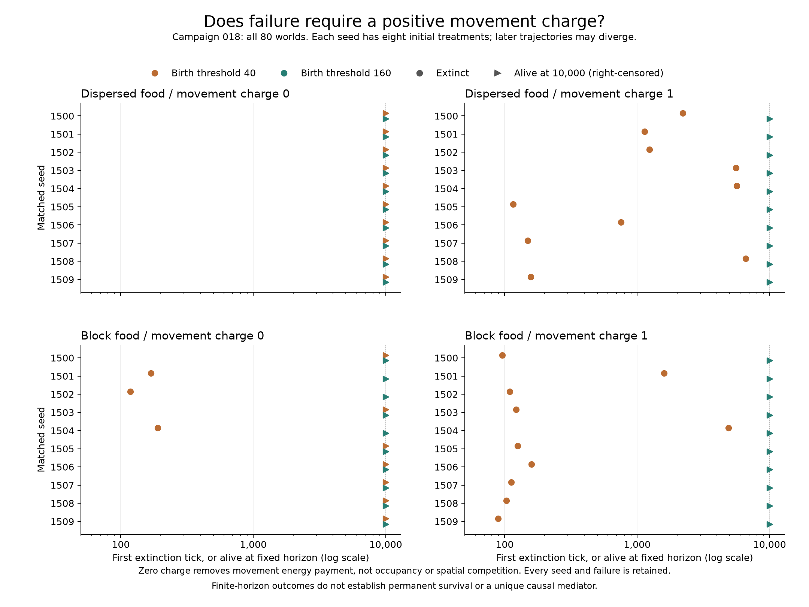

# 第十八轮：灭绝是否必须经过正的移动扣费？

**不必须。** 成片食物、繁殖阈值 40、移动扣费为零时，仍有三个世界在第 118–190 步灭绝。
对应高阈值世界均活到万步。因此本设计中，低阈值失败和阈值存活差异可以在没有移动扣费时出现。

按[预登记协议](../../experiments/v0/campaign-018.md)完成布局 × 阈值 × 移动扣费的八组对照，
每组十个新种子 1500–1509，共 80 次执行、800,000 步。每个种子的八组初始个体与随机状态配对，
同布局下四组初始食物完全一致。后续行动和随机抽取路径可以分化。

## 完整存活结果

| 初始布局 | 繁殖阈值 | 移动扣费 | 500步存活 | 5,000步存活 | 10,000步存活 | 已灭绝世界的灭绝时间范围 |
| --- | ---: | ---: | ---: | ---: | ---: | --- |
| 分散 | 40 | 0 | 10/10 | 10/10 | 10/10 | 无 |
| 分散 | 40 | 1 | 7/10 | 3/10 | 0/10 | 116–6613 |
| 分散 | 160 | 0 | 10/10 | 10/10 | 10/10 | 无 |
| 分散 | 160 | 1 | 10/10 | 10/10 | 10/10 | 无 |
| 成片 | 40 | 0 | 7/10 | 7/10 | 7/10 | 118–190 |
| 成片 | 40 | 1 | 2/10 | 0/10 | 0/10 | 89–4877 |
| 成片 | 160 | 0 | 10/10 | 10/10 | 10/10 | 无 |
| 成片 | 160 | 1 | 10/10 | 10/10 | 10/10 | 无 |

零扣费成片组的反例为种子 1501（169 步）、1502（118 步）、1504（190 步）。
正常扣费下，两种布局的低阈值组各 10/10 灭绝；高阈值的四十个世界全部活到万步。
零扣费使分散低阈值组由 0/10 提高到 10/10 存活，成片低阈值组由 0/10 提高到 7/10。
这些配对样本中的改善不等于取消扣费能保证存活，或所有环境都具有相同效应。



圆点表示首次灭绝时间，三角表示观察到万步时仍存活（右删失）。每个种子完整保留八种处理。
十个配对种子组不是八十个独立初始环境；表中范围也不是置信区间。
逐世界、阈值配对的四种联合存活状态和预定早期指标见[核验报告](results/campaign-018-verification.json)，
精简原始结果见[CSV](results/campaign-018.csv)。

## 这个结果排除了什么

它排除了“正的移动能量扣费是本设计每次失败的必要条件”的说法。
它没有排除移动成本在其他世界中促成失败，也没有把空间拥挤、摄食竞争或繁殖分割
中的某一项确定为唯一机制。免除移动扣费仍保留移动、目标占据、基础消耗和出生扣费，
还会改变个体能量、寿命、人口、摄食和后续随机路径。因此这是实际配置干预，
不能解读为仅关闭了拥挤开销，或从同一轨迹上减去了一笔费用。

## 验证与复算

启动源码 `ff8ee77a044e4b07b0b991ceecf48a59f334e4bd`，运行完成，未替换种子或改变终点。
该源码通过[自动检查](https://github.com/nikolasandwich/bitgenesis/actions/runs/34811950717)。
独立核验覆盖 80 个初始状态、10 组个体/随机状态八重配对、20 组食物地图四重配对、
800,080 行指标，以及前百步共 397,140 条能量行动账目。
两份核验分别检查总体指标与个体观测，保存输入校验值；结果 CSV 也与重建结果逐字段一致。

逐个体检查包括存活名单、出生与死亡、谱系标签、实际付款、摄食、子代能量分割和剩余能量。
所有零扣费世界的前百步移动消耗为零、没有移动付款阶段死亡；全时段指标也满足
“消耗增量＝基础消耗＋出生扣费”。全组早期移动计数和代际能量收支已保存在
[观测核验报告](results/campaign-018-observations.json)，后续解释会与预定结果和事后探索区分。

```sh
python -S scripts/summarize_v0_movement_charge.py --output data/my-018-metrics
python -S scripts/verify_v0_movement_charge_observations.py --metrics-verification data/my-018-metrics/summary.json --output data/my-018-observations
```

命令使用标准库，但需从脚本目录加载随附的同级核验模块，所以使用 `-S`，不加移除该路径的 `-I`。
本次第一次误加 `-I` 时在导入阶段失败，未创建结果；改用以上方式成功。没有重新运行或改写实验。
核验不重建未保存的受阻目标格、子代出生位置或完整局部食物轨迹，也不是独立随机动态重放。
143 项本地测试通过；固定十七轮下载包与第二版观测补充包都不包含本轮新数据。
当前仍只有 V0 运行阶段，没有感知、学习或智能证据。
