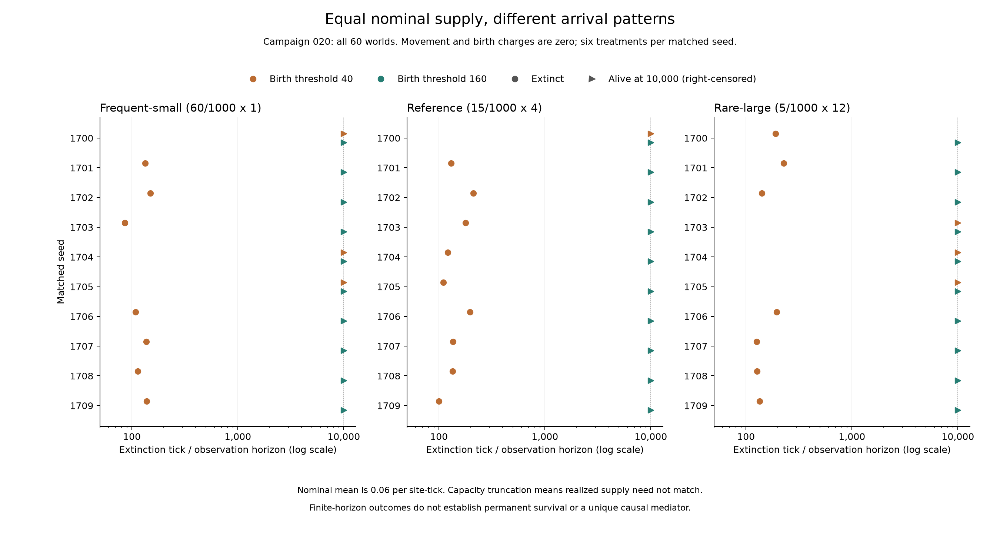

# 第二十轮：平均名义补给相同，补给方式会改变结局吗？

低繁殖阈值下，频繁少量、基准、稀疏大量三组分别有 **3/10、1/10、3/10**
的世界存活至一万步；高阈值三组均为 10/10。稀疏大量与基准之间既有仅前者存活，
也有仅后者存活的种子。当前结果不支持每个种子都受益的单调排序，亦未预定显著性检验。

按[预登记协议](../../experiments/v0/campaign-020.md)，十个新种子 1700–1709
分别运行六种处理，共六十个世界、600,000 个计算时间步。每种子六份初始个体、地图和
随机状态一致；后续轨迹可分化。这是十个配对种子块，不是六十个独立初始环境。

补给的概率（每千次）与批量分别为 (60,1)、(15,4)、(5,12)，名义平均均为
每格每步 0.06。容量为 24、单次摄食上限为 8，实际补给会受容量截断及消耗影响。
因此这是频率与批量的联合干预，不能称为实际能量相同的纯波动实验。
基因固定为 250、关闭突变，移动与出生直接扣费均为零；基础消耗保持每个体每步 1。

## 全部结局

| 阈值 | 补给 | 500步存活 | 5,000步存活 | 10,000步存活 | 首次灭绝范围 |
| --- | --- | --- | --- | --- | --- |
| 40 | 频繁少量 | 3/10 | 3/10 | 3/10 | 86–150 |
| 40 | 基准 | 1/10 | 1/10 | 1/10 | 100–211 |
| 40 | 稀疏大量 | 3/10 | 3/10 | 3/10 | 126–227 |
| 160 | 频繁少量 | 10/10 | 10/10 | 10/10 | 无 |
| 160 | 基准 | 10/10 | 10/10 | 10/10 | 无 |
| 160 | 稀疏大量 | 10/10 | 10/10 | 10/10 | 无 |

下表为低阈值的全部十个配对结局；数字为首次灭绝步数，“存活”为一万步右删失，
不表示永久存活。高阈值的三十个世界全部存活。

| 种子 | 频繁少量 | 基准 | 稀疏大量 |
| --- | --- | --- | --- |
| 1700 | 存活 | 存活 | 190 |
| 1701 | 133 | 130 | 227 |
| 1702 | 150 | 211 | 141 |
| 1703 | 86 | 178 | 存活 |
| 1704 | 存活 | 121 | 存活 |
| 1705 | 存活 | 110 | 存活 |
| 1706 | 108 | 196 | 194 |
| 1707 | 137 | 136 | 126 |
| 1708 | 114 | 135 | 127 |
| 1709 | 138 | 100 | 134 |

与基准的配对比较（每行十个种子）：

| 阈值 | 处理 | 双方存活 | 仅处理存活 | 仅基准存活 | 双方灭绝 |
| --- | --- | --- | --- | --- | --- |
| 40 | 频繁少量 | 1 | 2 | 0 | 7 |
| 40 | 稀疏大量 | 0 | 3 | 1 | 6 |
| 160 | 频繁少量 | 10 | 0 | 0 | 0 |
| 160 | 稀疏大量 | 10 | 0 | 0 | 0 |

同补给方式下的阈值配对，三组分别为 3/1/3 对双方存活、7/9/7 对仅高阈值存活，
无仅低阈值存活或双方灭绝。完整逐世界人口与全部配对保存在[指标核验报告](results/campaign-020-verification.json)。



三个面板按同一种子对齐；圆点为灭绝、三角为右删失，横轴为对数刻度。

## 实际补给与摄食

以下为每组全部十个世界的范围，包含灭绝世界，不是置信区间。
“新增”不含初始食物及个体能量，“摄食”为累计实际摄入。
灭绝后仍继续补给至一万步；这些后续资源不能解释为供应给活着的种群。

| 阈值 | 补给 | 检查步 | 累计新增资源 | 累计摄食 |
| --- | --- | --- | --- | --- |
| 40 | 频繁少量 | 100 | 5786–6087 | 6177–6523 |
| 40 | 频繁少量 | 500 | 25143–30307 | 6200–29877 |
| 40 | 频繁少量 | 5000 | 25656–299819 | 6200–298322 |
| 40 | 频繁少量 | 10000 | 25656–599438 | 6200–599734 |
| 40 | 基准 | 100 | 5704–6204 | 6116–6596 |
| 40 | 基准 | 500 | 23212–29744 | 6152–28384 |
| 40 | 基准 | 5000 | 25608–285860 | 6152–284120 |
| 40 | 基准 | 10000 | 25608–573160 | 6152–571204 |
| 40 | 稀疏大量 | 100 | 5256–6312 | 5972–6688 |
| 40 | 稀疏大量 | 500 | 20344–24276 | 5972–25836 |
| 40 | 稀疏大量 | 5000 | 25428–255048 | 5972–252700 |
| 40 | 稀疏大量 | 10000 | 25428–510140 | 5972–509560 |
| 160 | 频繁少量 | 100 | 5251–5641 | 3763–5151 |
| 160 | 频繁少量 | 500 | 26126–28647 | 20090–27239 |
| 160 | 频繁少量 | 5000 | 286004–291815 | 283195–290870 |
| 160 | 频繁少量 | 10000 | 577614–585283 | 575793–583528 |
| 160 | 基准 | 100 | 5196–5652 | 2992–5224 |
| 160 | 基准 | 500 | 25084–27552 | 20076–25912 |
| 160 | 基准 | 5000 | 278136–281500 | 276052–280472 |
| 160 | 基准 | 10000 | 559048–564148 | 558056–562272 |
| 160 | 稀疏大量 | 100 | 4984–5712 | 3772–5228 |
| 160 | 稀疏大量 | 500 | 23256–24804 | 17476–20504 |
| 160 | 稀疏大量 | 5000 | 248420–253912 | 246472–251836 |
| 160 | 稀疏大量 | 10000 | 498040–505796 | 496408–504164 |

高阈值所有世界均存活，但到一万步，频繁少量组实际新增资源范围高于基准，基准又高于
稀疏大量组。实际供给并未被匹配；这些数值也可能受种群消耗反馈影响，不能单凭它们
确定导致存活差异的唯一过程。

## 前百步过程

范围覆盖各组所有世界；受阻比例以全部移动尝试为分母。

| 阈值 | 补给 | 出生数 | 移动受阻比例 | 基础消耗 | 创始群体末期能量 |
| --- | --- | --- | --- | --- | --- |
| 40 | 频繁少量 | 146–163 | 29.34–40.43% | 8083–8338 | 0–7 |
| 40 | 基准 | 148–159 | 31.31–39.21% | 8006–8458 | 0–48 |
| 40 | 稀疏大量 | 152–165 | 25.84–37.13% | 7823–8431 | 0–18 |
| 160 | 频繁少量 | 5–8 | 4.83–9.28% | 3549–4605 | 1325–2051 |
| 160 | 基准 | 3–11 | 5.57–8.04% | 3558–4683 | 1018–2146 |
| 160 | 稀疏大量 | 4–10 | 4.98–7.57% | 3711–4577 | 1131–1909 |

这些过程描述不建立唯一因果中介关系。移动和出生直接支出均为零，不等于基础生存
没有成本；发生繁殖也会把能量从亲代转移给子代。

## 核验与复算

独立核验覆盖六十份初始状态、600,060 行指标、600,000 次能量和摄食转移，
以及前百步共 6,000 个世界时间步、370,320 条逐个体能量记录。
核对了个体覆盖、出生身份与谱系归属、摄食和能量账、记录中的合法位移，
以及总体指标与 JSON/CSV 汇总的一致性。

这不是独立随机轨迹重演；未记录的受阻目标、出生位置及完整局部食物历史未重建。
没有新增末期局部观察，也没有改变 V0 或实现 V1。

```sh
python -S scripts/summarize_v0_renewal_granularity.py --output data/check-020-metrics
python -S scripts/verify_v0_renewal_granularity_observations.py --metrics-verification docs/research/results/campaign-020-verification.json --output data/check-020-observations
python -I -S scripts/summarize_v0_renewal_granularity_processes.py --output data/check-020-processes
```

输出目录必须是新目录；前两条需要完整本地 `data/campaign-020`。
[逐世界结果](results/campaign-020.csv)、[观察核验](results/campaign-020-observations.json)、
[过程汇总](results/campaign-020-processes.json)与[过程表](results/campaign-020-processes.csv)
已随代码保存。已有十九轮页面及固定下载包保持原范围，尚不包含第二十轮。
