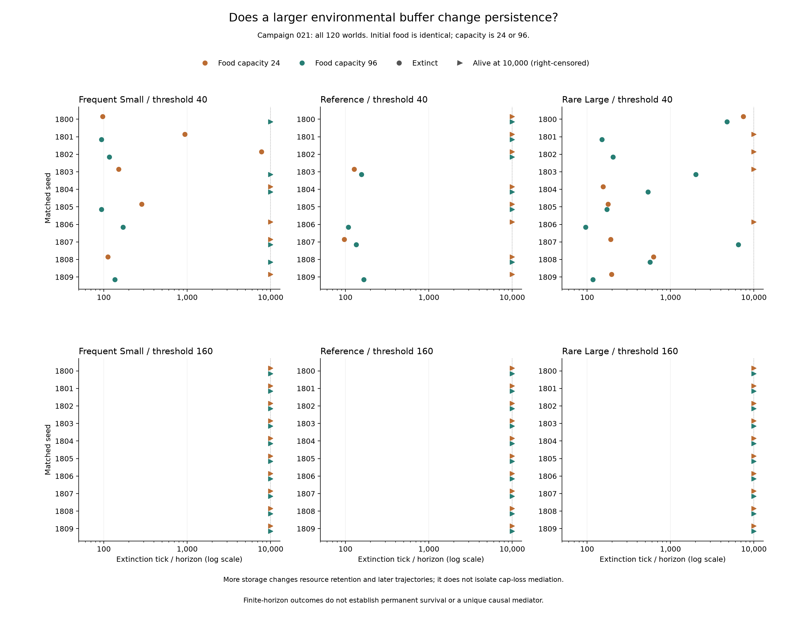

# 第二十一轮：增加食物容量是否改善存活？

低繁殖阈值下，容量从 24 增至 96 后，三种补给方式的净配对存活优势分别为 **+1、−2、−4**。预登记的“三组均为正”预测未获支持，三组均存在仅小容量存活的反例。高阈值下，两种容量的全部世界都存活到一万步。

[预登记协议](../../experiments/v0/campaign-021.md)固定种子 1800–1809、繁殖阈值 40/160、三种补给方式与容量 24/96，共 120 个世界、1,200,000 个计算时间步。每个种子的十二份初始地图、个体及随机状态匹配；这是十个种子块，不是 120 个独立初始环境。

两种容量均从同一地图的 5,120 单位食物开始，80 个体各有 24 能量，总初始能量 7,040。补给概率（每千次）与批量分别为 (60,1)、(15,4)、(5,12)。基因固定 250、关闭突变、移动与出生直接扣费为零、每个体每步基础消耗为 1、摄食上限为 8。容量干预改变后续储存与摄食轨迹，不能单独归因为容量损耗中介，也不等于无限资源。

## 全部结局

| 阈值 | 补给 | 容量 | 500步存活 | 5,000步存活 | 10,000步存活 | 灭绝步数范围 |
| --- | --- | --- | --- | --- | --- | --- |
| 40 | 频繁少量 | 24 | 6/10 | 5/10 | 4/10 | 97–7747 |
| 40 | 频繁少量 | 96 | 5/10 | 5/10 | 5/10 | 94–170 |
| 40 | 基准 | 24 | 8/10 | 8/10 | 8/10 | 97–127 |
| 40 | 基准 | 96 | 6/10 | 6/10 | 6/10 | 108–166 |
| 40 | 稀疏大量 | 24 | 6/10 | 5/10 | 4/10 | 155–7452 |
| 40 | 稀疏大量 | 96 | 5/10 | 1/10 | 0/10 | 96–6512 |
| 160 | 频繁少量 | 24 | 10/10 | 10/10 | 10/10 | 无 |
| 160 | 频繁少量 | 96 | 10/10 | 10/10 | 10/10 | 无 |
| 160 | 基准 | 24 | 10/10 | 10/10 | 10/10 | 无 |
| 160 | 基准 | 96 | 10/10 | 10/10 | 10/10 | 无 |
| 160 | 稀疏大量 | 24 | 10/10 | 10/10 | 10/10 | 无 |
| 160 | 稀疏大量 | 96 | 10/10 | 10/10 | 10/10 | 无 |

共 87 个世界存活至观察终点，33 个世界灭绝。存活为一万步右删失，不表示永久存活。

| 阈值 | 补给 | 双方存活 | 仅96存活 | 仅24存活 | 双方灭绝 | 净优势 |
| --- | --- | --- | --- | --- | --- | --- |
| 40 | 频繁少量 | 2 | 3 | 2 | 3 | +1 |
| 40 | 基准 | 6 | 0 | 2 | 2 | -2 |
| 40 | 稀疏大量 | 0 | 0 | 4 | 6 | -4 |
| 160 | 频繁少量 | 10 | 0 | 0 | 0 | +0 |
| 160 | 基准 | 10 | 0 | 0 | 0 | +0 |
| 160 | 稀疏大量 | 10 | 0 | 0 | 0 | +0 |

低阈值全部种子的配对结局如下，单元格按“容量24 / 容量96”排列，数字为首次灭绝步数。高阈值全部六十个世界存活。

| 种子 | 频繁少量 | 基准 | 稀疏大量 |
| --- | --- | --- | --- |
| 1800 | 97 / 存活 | 存活 / 存活 | 7452 / 4762 |
| 1801 | 939 / 94 | 存活 / 存活 | 存活 / 151 |
| 1802 | 7747 / 116 | 存活 / 存活 | 存活 / 205 |
| 1803 | 151 / 存活 | 127 / 156 | 存活 / 2001 |
| 1804 | 存活 / 存活 | 存活 / 存活 | 155 / 535 |
| 1805 | 284 / 94 | 存活 / 存活 | 178 / 173 |
| 1806 | 存活 / 170 | 存活 / 108 | 存活 / 96 |
| 1807 | 存活 / 存活 | 97 / 134 | 192 / 6512 |
| 1808 | 112 / 存活 | 存活 / 存活 | 624 / 566 |
| 1809 | 存活 / 136 | 存活 / 166 | 196 / 117 |

## 补给与早期过程

以下均为每组十个世界的范围，不是置信区间，也未按最终存活筛选。完整的 100、500、5,000、10,000 步供给与摄食检查点保存在[指标报告](results/campaign-021-verification.json)。

| 阈值 | 补给 | 容量 | 前100步补给 | 前100步摄食 | 前100步出生 |
| --- | --- | --- | --- | --- | --- |
| 40 | 频繁少量 | 24 | 5810–6023 | 6150–6526 | 145–160 |
| 40 | 频繁少量 | 96 | 6025–6225 | 6389–6784 | 152–164 |
| 40 | 基准 | 24 | 5616–6156 | 6168–6456 | 149–166 |
| 40 | 基准 | 96 | 5800–6500 | 6364–6912 | 153–168 |
| 40 | 稀疏大量 | 24 | 4928–6208 | 5880–6720 | 146–164 |
| 40 | 稀疏大量 | 96 | 5340–6432 | 6128–6632 | 154–168 |
| 160 | 频繁少量 | 24 | 5339–5649 | 3494–5057 | 4–9 |
| 160 | 频繁少量 | 96 | 6071–6220 | 3540–5197 | 7–14 |
| 160 | 基准 | 24 | 5112–5684 | 3352–4360 | 3–8 |
| 160 | 基准 | 96 | 5820–6516 | 3984–5076 | 6–15 |
| 160 | 稀疏大量 | 24 | 4676–5784 | 3124–4808 | 4–10 |
| 160 | 稀疏大量 | 96 | 5412–6540 | 3524–5120 | 6–14 |

灭绝发生的那一步仍计入“步开始时有个体”的窗口；其后的补给单独列出。仍存活的世界以一万步为窗口终点。不能用全程补给替代生存期间的可用资源。

| 阈值 | 补给 | 容量 | 有个体起始步的补给 | 灭绝后补给 |
| --- | --- | --- | --- | --- |
| 40 | 频繁少量 | 24 | 5815–599832 | 0–20038 |
| 40 | 频繁少量 | 96 | 5812–614441 | 0–93906 |
| 40 | 基准 | 24 | 5484–577108 | 0–20140 |
| 40 | 基准 | 96 | 6700–615544 | 0–93216 |
| 40 | 稀疏大量 | 24 | 8416–503556 | 0–17208 |
| 40 | 稀疏大量 | 96 | 5844–399936 | 85444–94504 |
| 160 | 频繁少量 | 24 | 579426–583432 | 0–0 |
| 160 | 频繁少量 | 96 | 614007–615160 | 0–0 |
| 160 | 基准 | 24 | 556876–562720 | 0–0 |
| 160 | 基准 | 96 | 611436–616104 | 0–0 |
| 160 | 稀疏大量 | 24 | 497892–504756 | 0–0 |
| 160 | 稀疏大量 | 96 | 609456–615956 | 0–0 |

[早期过程汇总](results/campaign-021-processes.json)保留十二组的移动尝试、受阻、基础死亡、创始者向后代能量转移等统计，并逐世界核对摄食、末期能量和零移动/出生扣费。它描述前100步，不能解释全部后期灭绝。

## 核验与解释边界

运行源版本为 `087e0536bce2f7ec0faa2757fed85e80daba7d1f`，协议先于运行登记。V0 引擎未修改。独立核验覆盖 120 份初始状态、十组十二路初始配对、1,200,120 行指标和 1,200,000 次摄食/能量转移；[个体记录核验](results/campaign-021-observations.json)覆盖全部世界的 12,000 个早期世界步。过程汇总验证两份报告的哈希关联。图中的120条记录与核验结果一致，已检查图像。

本轮不预设显著性检验；配对计数不证明总体效应或唯一机制。增大容量没有在三个低阈值环境中一致改善存活，但也不能推论大容量普遍有害。高阈值全存活只说明本次观察期没有观察到该结局的容量差异。当前没有感知或智能涌现证据。

[逐世界结果 CSV](results/campaign-021.csv) · [过程 CSV](results/campaign-021-processes.csv)

[二十一轮完整验收草稿](https://github.com/nikolasandwich/bitgenesis/releases/tag/untagged-decf49e3b2b0f36bdbe2)已包含本轮，固定源码 `9fb1bb3`。新目录解压后的三份报告复算一致，独立安装通过185项测试与千步演示审计。详见[验收入口](REVIEW.zh-CN.md)。旧下载包与历史协议保持原范围。
