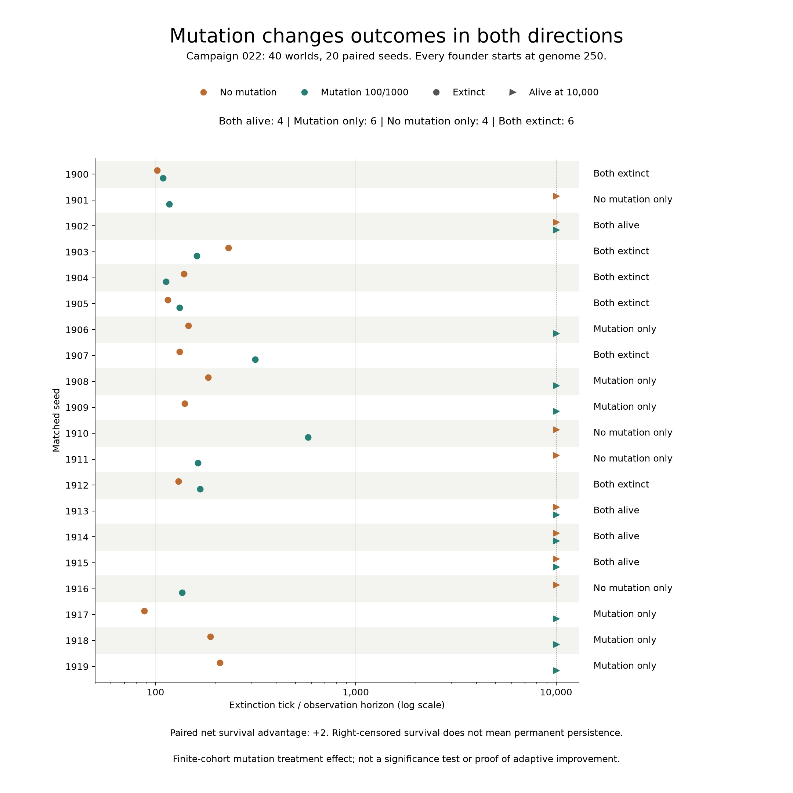

# 第二十二轮：从相同性状祖先出发，突变是否改善存活？

**突变组有10/20个世界存活到一万步，无突变组为8/20。配对净优势为+2，但有4个种子只在无突变时存活。** 这符合本队列预登记的正方向预测，未进行显著性检验，不支持每个世界都受益，也不能单凭此认定适应性进化。

[协议](../../experiments/v0/campaign-022.md)在运行前固定了20个新种子1900–1919，每种子突变概率0/100两组，共40个世界、400,000个计算时间步。所有创始个体的基因均为250，食物为相同成片地图上的5,120单位，个体能量合计1,920。两组初始个体、地图与随机状态匹配，后续随机调用及轨迹可以分化。

环境使用容量24、繁殖阈值40、补给概率15/1000与批量4、基础消耗1、单次摄食上限8，移动和出生直接扣费均为零。突变概率100/1000指每次符合条件出生时的尝试概率；扰动均匀取整数−100至100并截断到0–1000。尝试可能不改变性状，因此“改变性状的出生数”不等于突变尝试数。

第1、13轮从随机性状祖先群体出发；本轮从同一性状出发，在依据先前实验选定的环境中检验突变处理。它不是独立抽取的普遍环境，也不把20个配对种子当成40个独立初始环境。

## 全部主要结果

| 配对结局 | 种子数 |
| --- | --- |
| 两组都存活 | 4 |
| 仅突变组存活 | 6 |
| 仅无突变组存活 | 4 |
| 两组都灭绝 | 6 |

下表数字为首次灭绝步数，“存活”为一万步右删失，不表示永久存活。

| 种子 | 无突变 | 有突变 | 无突变末期种群 | 有突变末期种群 |
| --- | --- | --- | --- | --- |
| 1900 | 102 | 109 | 0 | 0 |
| 1901 | 存活 | 117 | 17 | 0 |
| 1902 | 存活 | 存活 | 76 | 73 |
| 1903 | 231 | 161 | 0 | 0 |
| 1904 | 139 | 113 | 0 | 0 |
| 1905 | 115 | 132 | 0 | 0 |
| 1906 | 146 | 存活 | 0 | 54 |
| 1907 | 132 | 314 | 0 | 0 |
| 1908 | 183 | 存活 | 0 | 70 |
| 1909 | 140 | 存活 | 0 | 62 |
| 1910 | 存活 | 578 | 31 | 0 |
| 1911 | 存活 | 163 | 71 | 0 |
| 1912 | 130 | 167 | 0 | 0 |
| 1913 | 存活 | 存活 | 72 | 58 |
| 1914 | 存活 | 存活 | 80 | 65 |
| 1915 | 存活 | 存活 | 46 | 52 |
| 1916 | 存活 | 136 | 30 | 0 |
| 1917 | 88 | 存活 | 0 | 62 |
| 1918 | 188 | 存活 | 0 | 56 |
| 1919 | 210 | 存活 | 0 | 59 |

圆点为首次灭绝，三角为万步时仍存活；颜色区分突变设置。右侧保留每个种子的配对分类。横轴为对数时间。

## 预定检查点

下表范围覆盖每组全部20个世界，灭绝后的零值保留。范围不是置信区间；空世界的平均基因与最高存活代数保存为null。全部240个世界/检查点的性状直方图与数值见[检查点报告](results/campaign-022-checkpoints.json)，精简表见[CSV](results/campaign-022-checkpoints.csv)。

| 突变概率/1000 | 步数 | 存活世界 | 种群范围 | 存活性状值数 | 曾出生性状值数 | 改变性状的出生数 |
| --- | --- | --- | --- | --- | --- | --- |
| 0 | 0 | 20/20 | 80–80 | 1–1 | 1–1 | 0–0 |
| 0 | 100 | 19/20 | 0–8 | 0–1 | 1–1 | 0–0 |
| 0 | 500 | 8/20 | 0–41 | 0–1 | 1–1 | 0–0 |
| 0 | 1000 | 8/20 | 0–59 | 0–1 | 1–1 | 0–0 |
| 0 | 5000 | 8/20 | 0–130 | 0–1 | 1–1 | 0–0 |
| 0 | 10000 | 8/20 | 0–80 | 0–1 | 1–1 | 0–0 |
| 100 | 0 | 20/20 | 80–80 | 1–1 | 1–1 | 0–0 |
| 100 | 100 | 20/20 | 1–15 | 1–7 | 10–27 | 9–26 |
| 100 | 500 | 11/20 | 0–59 | 0–8 | 11–63 | 11–65 |
| 100 | 1000 | 10/20 | 0–154 | 0–24 | 11–112 | 11–130 |
| 100 | 5000 | 10/20 | 0–72 | 0–12 | 11–314 | 11–390 |
| 100 | 10000 | 10/20 | 0–73 | 0–13 | 11–399 | 11–639 |

每个体的完整出生、死亡及亲子记录支持对存活性状和曾出生性状分别重建。无突变组的所有出生都保持250；有突变组可以产生新数值，但基因仍只控制随机移动概率，没有新增感知、记忆或行动语义。存活组的性状分布不能单独证明那些性状在统一环境中更有优势。

## 核验与可复现性

运行源为 `c63a72e`，预登记提交为 `87a2e4d`，规则仍是 `v0-darwin-1`。种子23的两组工程对照逐步匹配普通引擎的状态、事件、谱系与随机状态；祖先出生事件也明确重置为250。

[初始与指标核验](results/campaign-022-verification.json)覆盖40份初始状态、20组初始配对与400,040行指标；[历史核验](results/campaign-022-histories.json)重建148,821个个体，逐步核对存活集合、亲子、死亡、后代数、基因范围、代数和性状直方图。完整测试191项通过。记录不含完整移动路径，核验不声称重建每次突变尝试或全历史空间轨迹。

## 结论与下一步

本轮观察到开启突变的有限队列存活净优势，幅度为2个种子，并存在反方向个案。突变同时改变遗传变异、行动和后续随机轨迹；这些结果没有分离自然选择与漂变，也没有测定后代相对祖先的可遗传性能提升。

如果要进一步检验适应性改善，需要另行预定统一环境、采样规则和真实祖先对照，并处理灭绝世界没有终点后代的情况；不能从本轮挑出最好的存活个体再宣称普遍改善。本轮不会自动追加突变率扫描，V1仍仅有设计。

[逐世界结果CSV](results/campaign-022.csv)。二十一轮固定下载包不包含本轮；本轮配对图已提供，完整下载仍待制作，旧归档保留原范围。
