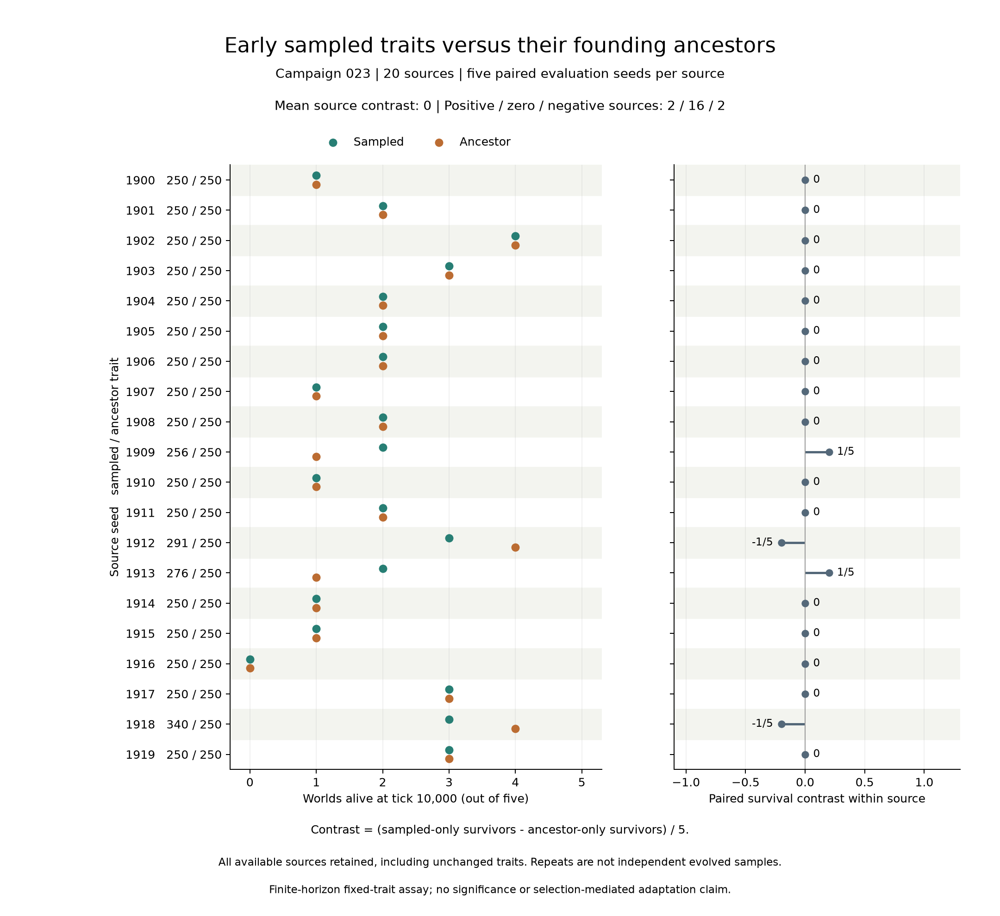

# 第二十三轮：早期抽样性状与真实祖先的统一环境对照

**20个来源的平均配对存活差为0；2个来源为正、2个为负、16个为零。本轮不支持预登记的正方向预测。** 未进行显著性检验，零均值不证明普遍等效或所有条件下无优势。

[协议](../../experiments/v0/campaign-023.md)在评估前固定采样、祖先追溯和比较方法。[采样清单](campaign-023-sampling.md)从第22轮全部20个突变来源世界的第100步存活个体中按性状无关的ID哈希取样，保留创始个体和未变化性状；全部来源可用，没有替换或删除来源。

每个来源用五个新评估种子比较抽样性状与真实创始祖先性状，共200个世界，每个运行10,000步。只转移基因，统一80个创始个体及其能量、初始食物地图和成对随机状态，关闭突变。环境沿用登记的成片食物、容量24、繁殖阈值40、补给15/1000与批量4、基础消耗1、摄食上限8，移动和出生直接费用为零。

## 全部来源结果

每行包含五个成对重复；存活指第10,000步仍存活，不表示永久持续。来源差为（仅抽样组存活−仅祖先组存活）/5，主要结果对20个来源等权平均。重复共享来源历史和性状，不是独立进化样本。

| 来源 | 抽样/祖先性状 | 两组存活 | 仅抽样存活 | 仅祖先存活 | 两组灭绝 | 来源差 |
| --- | --- | --- | --- | --- | --- | --- |
| 1900 | 250/250 | 1 | 0 | 0 | 4 | 0 |
| 1901 | 250/250 | 2 | 0 | 0 | 3 | 0 |
| 1902 | 250/250 | 4 | 0 | 0 | 1 | 0 |
| 1903 | 250/250 | 3 | 0 | 0 | 2 | 0 |
| 1904 | 250/250 | 2 | 0 | 0 | 3 | 0 |
| 1905 | 250/250 | 2 | 0 | 0 | 3 | 0 |
| 1906 | 250/250 | 2 | 0 | 0 | 3 | 0 |
| 1907 | 250/250 | 1 | 0 | 0 | 4 | 0 |
| 1908 | 250/250 | 2 | 0 | 0 | 3 | 0 |
| 1909 | 256/250 | 0 | 2 | 1 | 2 | 1/5 |
| 1910 | 250/250 | 1 | 0 | 0 | 4 | 0 |
| 1911 | 250/250 | 2 | 0 | 0 | 3 | 0 |
| 1912 | 291/250 | 2 | 1 | 2 | 0 | -1/5 |
| 1913 | 276/250 | 0 | 2 | 1 | 2 | 1/5 |
| 1914 | 250/250 | 1 | 0 | 0 | 4 | 0 |
| 1915 | 250/250 | 1 | 0 | 0 | 4 | 0 |
| 1916 | 250/250 | 0 | 0 | 0 | 5 | 0 |
| 1917 | 250/250 | 3 | 0 | 0 | 2 | 0 |
| 1918 | 340/250 | 2 | 1 | 2 | 0 | -1/5 |
| 1919 | 250/250 | 3 | 0 | 0 | 2 | 0 |

16份抽样性状仍为250，其80对评估的指标、事件和谱系字节完全一致，终态摘要也一致。其余4个来源各有正反方向的成对结果；不能只展示有利个案，也不能删除未变化性状再替换主要比较。

## 核验与记录

运行源为`cb320ae`，协议提交`2e340f8`，样本冻结提交`2ea4dca`。规则保持`v0-darwin-1`，200个世界合计2,000,000个计算时间步。

[指标核验](results/campaign-023-verification.json)检查200份初始状态、100组初始配对和2,000,200行指标。[生命史核验](results/campaign-023-histories.json)重建795,986个个体，检查亲子、出生死亡、后代数、固定性状继承和全部检查点直方图，并重算100对结局与20个来源差。全部201项测试通过。记录不包含完整空间移动历史。

[完整检查点](results/campaign-023-checkpoints.json)保留1,200条观察、240个来源/处理/时点分组，灭绝世界的空均值和空代数保持null。另有[检查点CSV](results/campaign-023-checkpoints.csv)与[全部200个世界结果](results/campaign-023.csv)。

## 解释与下一步

第22轮的突变处理净存活优势与本轮早期抽样性状对照是不同问题。本轮没有观察到平均存活优势，不能将前轮结果直接解释为后代性能改善；也没有分离选择、漂变与随机轨迹差异，更不检验后期种群整体适应。基因仍只表示随机移动概率，没有新增感知或记忆。

下一步先整理可复现归档和阶段证据。零结果不触发重新采样或自动扫描参数；任何后续机制检验应先提出可区分的预测和登记方案。V1保持设计阶段。二十二轮固定归档保持原范围，本轮新归档尚待制作。
