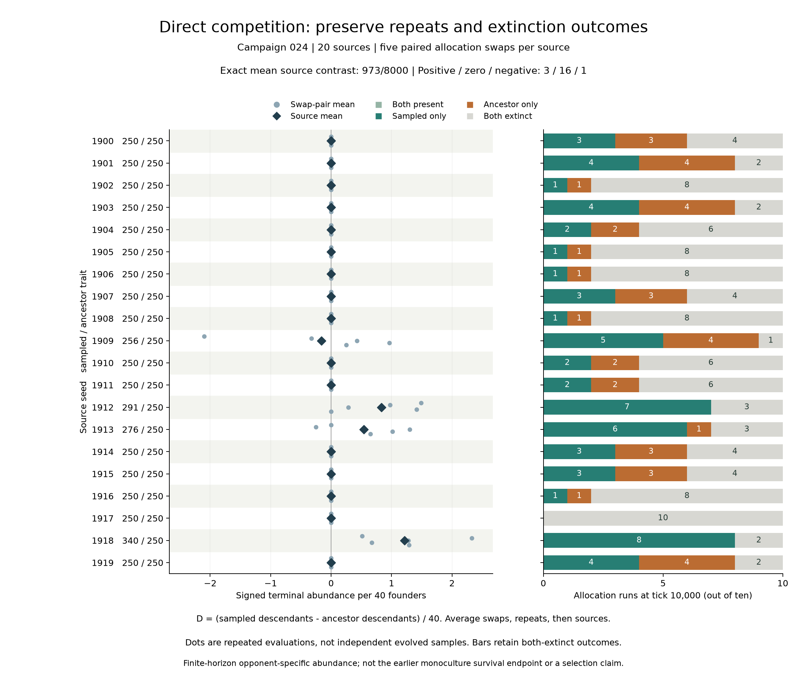

# 第二十四轮：抽样性状与真实祖先的直接竞争

**20个来源的平均竞争差为973/8000（0.121625），3个来源为正、1个为负、16个为零。**
这是本组有限时长、指定对手条件下的正向描述结果，不是显著性检验或一般适应性证明。

[预登记协议](../../experiments/v0/campaign-024.md)沿用第23轮全部20个来源的固定样本。
每个来源五个评估种子，每个种子交换两组初始位置，共200个世界，各10000步。
每组40个创始个体，关闭突变；组别只通过祖先ID统计，不进入行动或资源规则。
主指标D=(抽样组终点数量−祖先组终点数量)/40，先平均位置交换、再重复、最后来源。

第23轮独立世界的配对存活差为0，本轮共享资源世界的终点数量差为正，两者的
环境互动和终点不同，不能互相替代。1909来源甚至出现仅抽样存活次数更多、
终点数量差却为负，说明“赢的次数”和“最终数量优势”不是一个指标。

## 全部来源

每行状态计数来自10次位置分配运行。全部世界终点均没有双方共存。
双方灭绝时D为0，占比为空；这不表示可持续共存。

| 来源 | 抽样/祖先性状 | 仅抽样存活 | 仅祖先存活 | 双方灭绝 | 来源差 |
| --- | --- | --- | --- | --- | --- |
| 1900 | 250/250 | 3 | 3 | 4 | 0 |
| 1901 | 250/250 | 4 | 4 | 2 | 0 |
| 1902 | 250/250 | 1 | 1 | 8 | 0 |
| 1903 | 250/250 | 4 | 4 | 2 | 0 |
| 1904 | 250/250 | 2 | 2 | 6 | 0 |
| 1905 | 250/250 | 1 | 1 | 8 | 0 |
| 1906 | 250/250 | 1 | 1 | 8 | 0 |
| 1907 | 250/250 | 3 | 3 | 4 | 0 |
| 1908 | 250/250 | 1 | 1 | 8 | 0 |
| 1909 | 256/250 | 5 | 4 | 1 | -63/400 |
| 1910 | 250/250 | 2 | 2 | 6 | 0 |
| 1911 | 250/250 | 2 | 2 | 6 | 0 |
| 1912 | 291/250 | 7 | 0 | 3 | 333/400 |
| 1913 | 276/250 | 6 | 1 | 3 | 217/400 |
| 1914 | 250/250 | 3 | 3 | 4 | 0 |
| 1915 | 250/250 | 3 | 3 | 4 | 0 |
| 1916 | 250/250 | 1 | 1 | 8 | 0 |
| 1917 | 250/250 | 0 | 0 | 10 | 0 |
| 1918 | 340/250 | 8 | 0 | 2 | 243/200 |
| 1919 | 250/250 | 4 | 4 | 2 | 0 |

## 核验及边界

独立核验覆盖2,000,200条逐步指标和977,367个个体；80个同基因位置交换对
具有相同物理记录和互补组统计。六个登记检查点共1200条观察全部保留。
图已检查，展示全部来源，包括16个基因未变化来源；未挑选有利子集。

- [完整核验](results/campaign-024-verification.json)
- [20个来源](results/campaign-024-sources.csv)、[100个交换对](results/campaign-024-pairs.csv)、[200次运行](results/campaign-024-runs.csv)
- [六个检查点](results/campaign-024-checkpoints.json)

V0累计已完成24轮、1524次执行、14,440,000计算步；其中212000步为已有轨迹前缀重放，
不应计作新的独立证据。此前23轮完整下载归档保持原样，尚未扩展为24轮归档。
V0仍没有食物传感器或记忆。本轮不证明选择机制、感知或智能；V1的感知价值
必须通过自身的干预实验判断。研究推进不再依赖继续追加V0实验。
