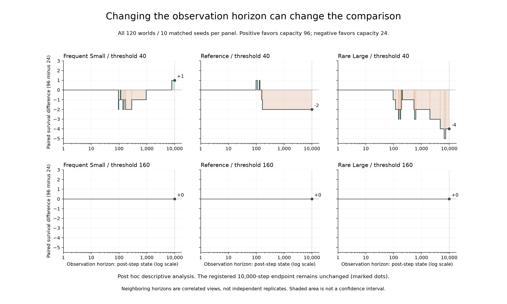

# 第二十一轮事后复查：观察终点会改变容量比较吗？

**低阈值的频繁少量与基准补给组，净配对存活差随观察终点发生过方向变化；稀疏大量组从未出现正值。** 这不改变原先一万步的主要结论：三组净优势为 +1、−2、−4，预登记的三组均为正预测未获支持。

本分析是在完整结局已知后提出的事后描述，使用[已核验的120个世界](results/campaign-021-verification.json)，没有新增模拟或选择部分种子。逐一考虑第1至10,000步结束时的存活状态；灭绝发生在第t步，则该世界在第t步结束时已不存活。观察期内未灭绝的世界按右删失处理，不外推未来寿命。

每个时刻的净差等于“仅容量96存活的种子数 − 仅容量24存活的种子数”。以下是各类观察终点的数量；它们高度相关，不是独立重复、胜率或显著性检验。

| 阈值 | 补给 | 净差为正的终点数 | 净差为负的终点数 | 净差为零的终点数 |
| --- | --- | --- | --- | --- |
| 40 | 频繁少量 | 2254 | 841 | 6905 |
| 40 | 基准 | 18 | 9845 | 137 |
| 40 | 稀疏大量 | 0 | 9896 | 104 |
| 160 | 频繁少量 | 0 | 0 | 10000 |
| 160 | 基准 | 0 | 0 | 10000 |
| 160 | 稀疏大量 | 0 | 0 | 10000 |

横轴为对数时间，纵轴为十个配对种子的存活净差；着色表示净差方向，不是置信区间。圆点标出预先固定的一万步主要终点。

## 低阈值的完整分段

只要没有世界灭绝，四类配对状态就保持不变。下表保留所有事件边界，包括净差相同但配对分类发生变化的边界。区间端点均包含在内；第0步的初始化状态不计入上述一万步计数。

| 补给 | 结束步区间 | 双方存活 | 仅96 | 仅24 | 双方灭绝 | 净差 |
| --- | --- | --- | --- | --- | --- | --- |
| 频繁少量 | 0–93 | 10 | 0 | 0 | 0 | +0 |
| 频繁少量 | 94–96 | 8 | 0 | 2 | 0 | -2 |
| 频繁少量 | 97–111 | 7 | 1 | 2 | 0 | -1 |
| 频繁少量 | 112–115 | 6 | 2 | 2 | 0 | +0 |
| 频繁少量 | 116–135 | 5 | 2 | 3 | 0 | -1 |
| 频繁少量 | 136–150 | 4 | 2 | 4 | 0 | -2 |
| 频繁少量 | 151–169 | 3 | 3 | 4 | 0 | -1 |
| 频繁少量 | 170–283 | 2 | 3 | 5 | 0 | -2 |
| 频繁少量 | 284–938 | 2 | 3 | 4 | 1 | -1 |
| 频繁少量 | 939–7746 | 2 | 3 | 3 | 2 | +0 |
| 频繁少量 | 7747–10000 | 2 | 3 | 2 | 3 | +1 |
| 基准 | 0–96 | 10 | 0 | 0 | 0 | +0 |
| 基准 | 97–107 | 9 | 1 | 0 | 0 | +1 |
| 基准 | 108–126 | 8 | 1 | 1 | 0 | +0 |
| 基准 | 127–133 | 7 | 2 | 1 | 0 | +1 |
| 基准 | 134–155 | 7 | 1 | 1 | 1 | +0 |
| 基准 | 156–165 | 7 | 0 | 1 | 2 | -1 |
| 基准 | 166–10000 | 6 | 0 | 2 | 2 | -2 |
| 稀疏大量 | 0–95 | 10 | 0 | 0 | 0 | +0 |
| 稀疏大量 | 96–116 | 9 | 0 | 1 | 0 | -1 |
| 稀疏大量 | 117–150 | 8 | 0 | 2 | 0 | -2 |
| 稀疏大量 | 151–154 | 7 | 0 | 3 | 0 | -3 |
| 稀疏大量 | 155–172 | 6 | 1 | 3 | 0 | -2 |
| 稀疏大量 | 173–177 | 5 | 1 | 4 | 0 | -3 |
| 稀疏大量 | 178–191 | 5 | 1 | 3 | 1 | -2 |
| 稀疏大量 | 192–195 | 4 | 2 | 3 | 1 | -1 |
| 稀疏大量 | 196–204 | 4 | 2 | 2 | 2 | +0 |
| 稀疏大量 | 205–534 | 3 | 2 | 3 | 2 | -1 |
| 稀疏大量 | 535–565 | 3 | 1 | 3 | 3 | -2 |
| 稀疏大量 | 566–623 | 2 | 1 | 4 | 3 | -3 |
| 稀疏大量 | 624–2000 | 2 | 1 | 3 | 4 | -2 |
| 稀疏大量 | 2001–4761 | 1 | 1 | 4 | 4 | -3 |
| 稀疏大量 | 4762–6511 | 0 | 1 | 5 | 4 | -4 |
| 稀疏大量 | 6512–7451 | 0 | 0 | 5 | 5 | -5 |
| 稀疏大量 | 7452–10000 | 0 | 0 | 4 | 6 | -4 |

高阈值的全部六十个世界在全部观察终点均存活，三个补给组的净差始终为零。这只涉及存活状态，不代表其他过程相同。

## 核验与用途

分析器要求完整且唯一的120世界身份，并核对灭绝时间、删失、100/500/5,000步状态以及10,000步的四类配对结局。用包含第一步灭绝、终点灭绝和右删失的256个双配对小案例，逐步穷举对照事件区间展开结果，检查区间无重叠、无遗漏和边界语义。完整分段与输入/分析脚本哈希见[机器报告](results/capacity-horizons-021.json)。

本分析说明，换观察窗口可能改变描述性排序；不能挑出18个有利终点来宣称基准组总体受益，也不能将9,845个不利终点当作9,845个独立样本。它没有隔离容量损耗、空间可达性或繁殖需求的因果作用。

复算：`python -I -S scripts/analyze_v0_capacity_horizons.py --output data/capacity-horizons-check.json`，输出路径须不存在。分析仅读取已提交的精简核验报告。二十一轮固定归档先于本分析制作，因此不包含此脚本和报告；原归档和主要结局保持不变。

## 从 Git 源码复算的补充核对

从提交 `2a8f24c` 用 Git 导出干净源码，仅依赖包内精简指标报告复算，全部六组分段、终点计数、分析范围及输入哈希一致。唯一不同字段是脚本原始字节哈希：本地文件采用 CRLF，Git 导出为 LF；将换行统一后，两份脚本逐字节相同。详见[源码复算记录](results/capacity-horizons-source-review-021.json)。

因此，跨换行格式复算时应分别核对计算结果与原始文件身份，不能把这次结果描述为完整 JSON 字节相同。本记录保留两种原始哈希和统一换行后的哈希，没有改写先前报告或放宽输入数据核验。
