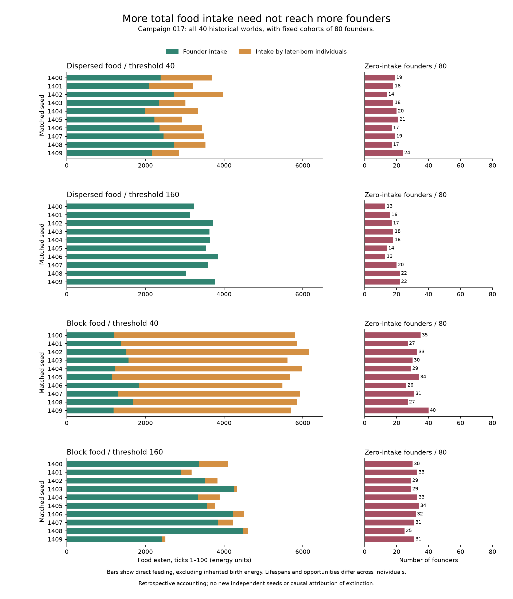

# 第 17 轮：总摄食量如何分配到个体

这是四十个既有世界前百步的事后分析，不增加正式实验数或独立种子。
同一组每个世界始终以全部 80 名创始个体为固定分母，保留未摄食者；
后续出生个体另行统计，包括第 100 步出生、尚未行动的个体。

| 布局 / 繁殖阈值 | 创始个体摄食总量 | 未摄食创始个体数 / 80 | 摄食最多的 16 名占创始摄食比例 | 后续出生个体摄食总量 |
| --- | --- | --- | --- | --- |
| 分散 / 40 | 1,988–2,736 | 14–24 | 51.95%–66.54% | 680–1,348 |
| 分散 / 160 | 3,028–3,848 | 13–22 | 52.04%–65.13% | 0 |
| 成片 / 40 | 1,156–1,832 | 26–40 | 70.52%–88.22% | 3,652–4,752 |
| 成片 / 160 | 2,428–4,476 | 25–34 | 73.79%–93.29% | 80–728 |

范围跨每组十个世界，不是置信区间。各列极值可能来自不同种子，不能相加拼成一个世界。
“最多的 16 名”按各世界实际摄食排序，不是预先指定的同一批个体。

原阈值成片组较高的总摄食量，不能解释为资源更广泛地覆盖创始群体。
该组创始个体反而摄食更少、零摄食人数更多，摄食集中度也更高；
同时更多的摄食来自出生后的新个体。这给先前的总量比较补上了群体构成。

但高阈值成片组也存在较高的创始摄食集中度，而其十个世界都活到万步。
所以集中度本身不是这批数据中足以解释灭绝的条件。这里统计直接摄食，
不包含从父代获得的出生能量，也不等同于个体持有的能量或完整谱系资源份额。

个体的存活时间、出生时间和行动机会不同。创始群体在处理之间身份和初始位置配对，
后续轨迹仍会分化；累计摄食不能当作等暴露条件下的获取能力。
零摄食也不意味着每一步都遇到空食物格，死亡前付费阶段的个体根本没有进入摄食。
本分析不把上述差异解释为食物布局或繁殖阈值效应的唯一中介。

## 逐世界图



左列绿色为创始个体摄食、橙色为后续出生个体摄食；右列以固定 80 名创始个体为分母，
显示未摄食者人数。所有面板使用相同刻度，保留十个种子的每个世界。
四十根堆叠条形的总量均与先前独立的逐摄食记录汇总报告一致。
图示数据、输入与绘图脚本哈希见[图表记录](figures/campaign-017-individual-intake.json)。

## 复算与核对

从当前源码运行：

```sh
python -I -S scripts/analyze_v0_individual_intake.py --input data/action-replay-017 --output data/my-individual-intake
```

输出每个体的出生/死亡时间、行动次数、摄食次数、摄食总量和分组 CSV，
以及逐世界与逐组 `summary.json`。输入的八十个文件逐一匹配已核验行动记录的 SHA-256。
每一步进食和死亡 ID 恰好覆盖行动个体，出生 ID 连续；每个体行动次数与生命时段、
摄食次数与死亡阶段一致，总摄食在个体间分配后保持不变。输出 CSV 的八十个群体计数
和摄食总量也与报告逐项相符。

完整报告见[逐世界结果](results/individual-intake-017.json)。分析只用标准库，不运行引擎。
[观测补充包](../design/observation-supplement.md)包含所需输入，但其固定源码早于本分析；
使用当前分析脚本和结果文件，不能声称旧包内已经包含这项新分析。

更新：以上关于固定补充包缺少后续工具或数据的说明指第一版。
[第二版补充包](../design/observation-supplement.md#verified-revision-2-download)
现已包含能量账本和八项复算所需输入，旧版未被覆盖。
