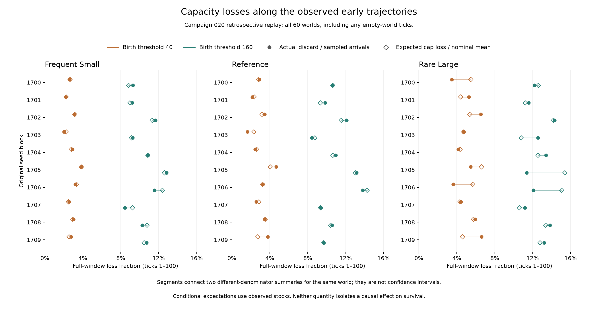

# 第二十轮库存观测：前百步的容量截断损失

依照[事先登记的回放方案](../../experiments/v0/observation-020-renewal-stocks.md)，
对全部六十个原世界回放前百步，共 6,000 个补充回放步。原实验结局在登记时已知，
因此这是回顾性过程观测，没有新增独立样本。

## 先区分两个分母

“实际截断比例”是实际抽中的资源中，被容量上限挡住的比例，分母为成功到达的未截断总量。
“期望损失比例”先按每步真实库存计算条件期望，再除以对应窗口的名义期望总量。
完整百步的名义期望是每个世界 6,144；实际未截断到达量会随随机抽签变化。
两者不是同一个统计量，不能把差额直接叫作测量误差或因果效应。

## 完整百步：保留每组全部十个世界

以下是跨世界范围，包含该窗口内灭绝后的空世界步骤，不是置信区间。

| 阈值 | 补给 | 实际新增资源 | 实际截断资源 | 实际截断比例 | 条件期望损失比例 |
| --- | --- | --- | --- | --- | --- |
| 40 | 频繁少量 | 5786–6087 | 125–237 | 2.01–3.88% | 2.25–3.83% |
| 40 | 基准 | 5704–6204 | 100–280 | 1.65–4.68% | 2.32–4.04% |
| 40 | 稀疏大量 | 5256–6312 | 216–424 | 3.49–6.61% | 4.33–6.61% |
| 160 | 频繁少量 | 5251–5641 | 517–779 | 8.44–12.84% | 8.83–12.62% |
| 160 | 基准 | 5196–5652 | 520–832 | 8.43–13.80% | 8.76–14.27% |
| 160 | 稀疏大量 | 4984–5712 | 632–900 | 11.18–14.31% | 10.60–15.39% |

同一种补给方式内，高阈值组的前百步实际截断比例范围高于低阈值组，却全部存活至万步。
因此较高截断比例不能直接解释为较差存活，也不能推断截断有益；库存与消耗共同变化，
本观测没有单独干预截断过程。



每行按原始种子对齐，颜色区分繁殖阈值；实心圆为实际截断比例，空心菱形为条件期望损失比例。
细线连接同一个世界的两个不同分母的摘要，不是误差条或置信区间。各面板使用相同横轴。
完整图表数据保留全部六十个世界，不按存活结局筛选。

## 存活起始步与空世界步骤

灭绝当步仍属于“存活起始步”，因为食物再生先于可能致死的基础消耗。
零长度窗口的比例为缺失值，不是零损失率。下面列出各组百步内空世界窗口：

| 阈值 | 补给 | 有空世界窗口的世界数 | 各世界空世界步数范围 |
| --- | --- | --- | --- |
| 40 | 频繁少量 | 1/10 | 0–14 |
| 40 | 基准 | 0/10 | 0–0 |
| 40 | 稀疏大量 | 0/10 | 0–0 |
| 160 | 频繁少量 | 0/10 | 0–0 |
| 160 | 基准 | 0/10 | 0–0 |
| 160 | 稀疏大量 | 0/10 | 0–0 |

全部 180 行世界×窗口记录，以及三类窗口的完整范围见[逐世界表](results/renewal-stocks-020-worlds.csv)
和[汇总](results/renewal-stocks-020-summary.json)。实际新增、未截断到达、截断损失及条件期望
均满足“全窗口 = 存活起始窗口 + 空世界窗口”。按是否灭绝划分的结果不具备相同观察时长，
不能替换原预登记的固定终点比较。

## 核验与解释边界

独立核验从保存的完整食物向量重建 6,000 份直方图，从每步复制的随机状态重建
6,144,000 次补给抽签；接纳量等于原轨迹实际新增量，未截断量等于接纳量加截断量。
三种补给方式在同一库存下的条件期望以精确分数保存。6,060 行边界指标与原实验一致。

这些检验不重建步骤中的全部个体行动，也不独立证明初始化之后的随机状态就是唯一历史状态。
观测不改变轨迹的工程对照另在六种配置、工程种子 23 下逐步核验了完整引擎状态。

不同处理经历的库存不同。本观测只描述实际轨迹上的截断，不能确定截断对存活的独立贡献，
也不能把同库存条件期望解释为替换补给方式后的完整世界。前百步不是万步全过程，
没有感知、记忆或控制器进化的新证据。

```sh
python -I -S scripts/verify_v0_renewal_stocks.py --output data/my-stock-check
python -I -S scripts/summarize_v0_renewal_stocks.py --output data/my-stock-summary
```

输出须使用新目录。第一条需要另行保存的 `data/renewal-stocks-020` 和原第二十轮数据；
第二条使用仓库中的核验报告。完整回放的源码为 `41b3736`，汇总在其后追加。
[核验报告](results/renewal-stocks-020-verification.json)记录输入哈希。
固定二十轮整包保持原样，不包含本次新增回放记录。正式实验计数不变。
