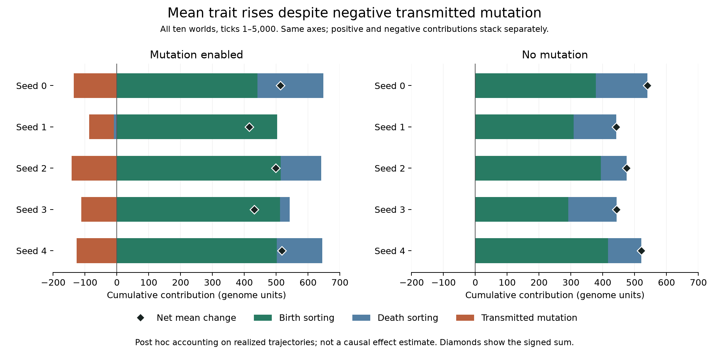

# Mean-trait change: demographic sorting and transmitted mutation

Retrospective analysis of the ten campaign-001 runs, ticks 1–5000. No new worlds,
seed replicates or preregistered hypothesis test. The complete artifact audit runs
before decomposition, and all 50000 transitions are reconstructed from events.

For one tick, let N and m be the living count and mean trait before the tick,
B and D the birth/death counts, and N' = N + B - D. For each newborn let p be its
parent's trait and c its own; for each death let d be the deceased trait.
No individual changes its genome during life in these V0 rules. Thus:

```
birth sorting = (sum(p) - B*m) / N'
death sorting = (D*m - sum(d)) / N'
transmitted mutation = sum(c-p) / N'
change in living mean = birth sorting + death sorting + transmitted mutation
```

This follows by writing the new trait sum as N*m + sum(c) - sum(d).
All three terms use the pre-tick mean and post-tick denominator; this convention
is fixed rather than choosing a sequential birth/death ordering. Rational arithmetic
checks the identity exactly each tick and its cumulative telescoping sum. The
reconstructed living means also match the saved metrics. Extinction would make
the next mean undefined and is rejected, not imputed as zero; these ten runs survive.

## Results

Values below are sums of per-tick contributions in the genome's 0–1000 units,
rounded for display. They are not percentages, birth counts or fitness scores.

| Treatment | Seed | Birth sorting | Death sorting | Mutation | Net mean change |
|---|---:|---:|---:|---:|---:|
| Mutation | 0 | 440.74 | 207.13 | -135.22 | 512.65 |
| Mutation | 1 | 502.48 | -9.57 | -77.35 | 415.56 |
| Mutation | 2 | 514.43 | 126.67 | -142.47 | 498.63 |
| Mutation | 3 | 511.56 | 30.63 | -111.49 | 430.70 |
| Mutation | 4 | 501.74 | 142.77 | -126.59 | 517.91 |
| No mutation | 0 | 378.15 | 161.46 | 0.00 | 539.61 |
| No mutation | 1 | 309.00 | 132.84 | 0.00 | 441.84 |
| No mutation | 2 | 394.24 | 80.78 | 0.00 | 475.01 |
| No mutation | 3 | 291.50 | 152.04 | 0.00 | 443.54 |
| No mutation | 4 | 416.06 | 105.10 | 0.00 | 521.16 |



Both panels use the same horizontal scale. A negative death term in mutation
seed 1 is included to the left of zero. The bars represent separate signed
contributions, not fractions of the net change; positive totals may exceed the
net change when another term offsets them. No uncertainty interval is implied.
[Vector figure](figures/trait-change-001.svg) and [plotted values/hashes](figures/trait-change-001.json)
are retained. Regenerate with `python scripts/plot_v0_trait_change.py --output data/my-trait-change-figure`
after installing the optional analysis dependencies.

Every mutation run has positive net change (415.56–517.91) but a negative cumulative
transmitted-mutation contribution (-142.47 to -77.35). All birth-sorting contributions
are positive. Death sorting is positive in four mutation runs and negative in seed 1;
the negative term means deaths cumulatively pull the living mean down under this
accounting convention. The no-mutation control has exactly zero transmission change.

This shows that a rising mean does not imply that realized mutations directly
push the mean upward. It is consistent with the separately calibrated mutation
kernel having an inward mean near the upper boundary, but this decomposition
does not measure how much clipping alone caused. It includes the actual sequence
of mutations and the evolving distribution of parents.

## Interpretation limits

Demographic sorting includes chance, spatial effects and frequency-dependent
competition as well as trait-associated reproductive/survival differences. These
terms do not isolate causal selection on movement. The mutation term is the direct
per-birth numerical change on the realized trajectory, not the total counterfactual
effect of enabling mutation. Earlier mutations can affect later reproduction,
death and random-number consumption; those downstream effects are not assigned
to the transmission term. Do not subtract it to predict a no-mutation world.

This is overlapping-generation bookkeeping, not a comparison of synchronized
biological generations. Whole-world runs are the replicate units; individual births
and the 5000 ticks are not independent replicates. No significance test or claim
of functional innovation is made.

## Reproduce

```sh
python scripts/analyze_v0_trait_change.py --input data/campaign-001 --output data/my-trait-change
```

Requires an installed BitGenesis package and the original full campaign-001
artifacts. Output paths must be new. The script retains all ten runs and records
input/script hashes in [the sidecar](results/trait-change-001.json); full-precision
results are in [the CSV](results/trait-change-001.csv). Hand-computed tests cover
mixed birth/death/mutation, population growth, no-event and extinction boundaries.
This analysis postdates the thirteen-campaign fixed archive; its required raw
campaign-001 records are included there, but this new script/report are not.

## Local mutation-kernel reference along the realized trajectory

A further post hoc diagnostic evaluates the known single-birth expectation at
each recorded parent genome g, mutation probability q and mutation step s:

```
local_reference(g) = q/(2*s+1) * sum(clip(g+d, 0, 1000)-g, d=-s..s)
weighted_reference = sum(local_reference(parent) / recorded_post_tick_population)
```

Here q is the probability as a fraction, not the per-thousand integer. Exact
rational enumeration precedes the weighted sum. The five mutation runs have the
following results; all five no-mutation runs have exactly zero observed and
reference increments. Full ten-world data are retained in
[the CSV](results/mutation-reference-001.csv) and [hash sidecar](results/mutation-reference-001.json).

| Seed | Births | Births from parent >900 | Observed weighted mutation | Kernel reference | Difference |
|---|---:|---:|---:|---:|---:|
| 0 | 7519 | 6317 | -135.22 | -135.15 | -0.07 |
| 1 | 7684 | 5099 | -77.35 | -60.52 | -16.83 |
| 2 | 7532 | 6257 | -142.47 | -137.36 | -5.11 |
| 3 | 7615 | 6219 | -111.49 | -134.42 | 22.94 |
| 4 | 7512 | 6582 | -126.59 | -143.03 | 16.43 |

All reference sums are negative, consistent with many births having parents near
the upper bound where clipping creates an inward local expectation. Differences
have both signs; no significance test is attached to them. Repeated births from
the same parent and related descendants are not independent observations.

This is a reference evaluated on *observed* parents and post-tick populations.
Those quantities arise from the evolving world and shared random stream. The
weighted reference is not asserted to be an unbiased unconditional expectation
of the complete trajectory, and its difference is not assumed to have zero mean
or independent increments. It does not isolate the total causal effect of clipping:
changing the kernel would change later genomes, births, deaths and random draws.

The helper verifies raw-file hashes against the earlier audited decomposition
and reproduces its observed transmission term exactly. It also saves unweighted
raw increments and references, which have different units from changes in mean.
Run `python scripts/analyze_v0_mutation_reference.py --output data/my-mutation-reference`
with campaign-001 inputs present. This remains a reanalysis, with no new worlds.

## Whole-run direction is not a persistent late trend

A subsequent post hoc analysis partitions every world into all five contiguous
1000-tick windows: 1–1000, 1001–2000, 2001–3000, 3001–4000 and 4001–5000.
A window starting at tick 4001 compares the mean at tick 4000 with that at 5000.
No windows or seeds are omitted from [the full CSV](results/trait-windows-001.csv).
Each window's identity and all five windows' sum are checked exactly; total
components reproduce the earlier full-run decomposition. These are repeated
observations of the same worlds, not fifty independent replicates.

During the first thousand ticks, every world increases mean trait: mutation
403.51–496.46 and no mutation 415.27–520.50. The last thousand differ:

| Treatment | Seed | Births | Deaths | Birth sorting | Death sorting | Mutation | Net change |
|---|---:|---:|---:|---:|---:|---:|---:|
| Mutation | 0 | 1440 | 1440 | -10.10 | 13.94 | -44.68 | -40.84 |
| Mutation | 1 | 1521 | 1483 | 67.58 | -28.42 | -24.88 | 14.29 |
| Mutation | 2 | 1500 | 1492 | 31.18 | 3.36 | -36.13 | -1.59 |
| Mutation | 3 | 1486 | 1507 | 29.35 | -13.22 | -30.63 | -14.50 |
| Mutation | 4 | 1494 | 1500 | 30.67 | 9.83 | -22.33 | 18.16 |
| No mutation | 0 | 1469 | 1452 | 0.00 | 0.00 | 0.00 | 0.00 |
| No mutation | 1 | 1454 | 1446 | 0.00 | 0.00 | 0.00 | 0.00 |
| No mutation | 2 | 1490 | 1476 | 0.00 | 0.00 | 0.00 | 0.00 |
| No mutation | 3 | 1485 | 1462 | 0.00 | 0.00 | 0.00 | 0.00 |
| No mutation | 4 | 1452 | 1457 | 0.00 | 0.00 | 0.00 | 0.00 |

Three mutation worlds decrease their mean late and two increase it, despite all
five having positive full-run changes. Mutation seed 0 even has negative late
birth sorting, whereas its full-run birth sorting is positive. A full-run sum
must not be presented as evidence of a constant direction of change at every time.

No-mutation worlds have zero late trait contributions while each records over
1400 births and 1400 deaths. Trait fixation therefore coexists with demographic
turnover; it does not imply frozen spatial, energy or population state. Neither
the late variation nor the flat controls establish statistical stationarity,
permanent stability or mutation-selection equilibrium.

Reproduce using `python scripts/analyze_v0_trait_windows.py --output data/my-trait-windows`.
The [sidecar](results/trait-windows-001.json) records raw-file, reference, helper
and script hashes. No new simulation was performed. The uploaded fixed archive
predates this analysis but contains the required campaign-001 raw events.

## Portable archive reanalysis

The fourteen-campaign source snapshot `6d98fb9` contains all three analyses above.
Using its extracted scripts, raw records and references with a fresh-installed
archived wheel, all three JSON reports match their archived counterparts exactly;
all three CSVs are byte-identical. JSON equality includes recorded provenance
hashes. [Recorded comparison and launch modes](results/portable-trait-analysis-014.json).

The main decomposition uses the installed package audit; the window helper also
imports its sibling script and therefore uses normal script mode. The local
kernel-reference analysis ran with isolated mode and site packages disabled.
This verifies reanalysis under Python 3.12.10, not a new simulation or a claim
that every script is independent of its package/helper dependencies.
