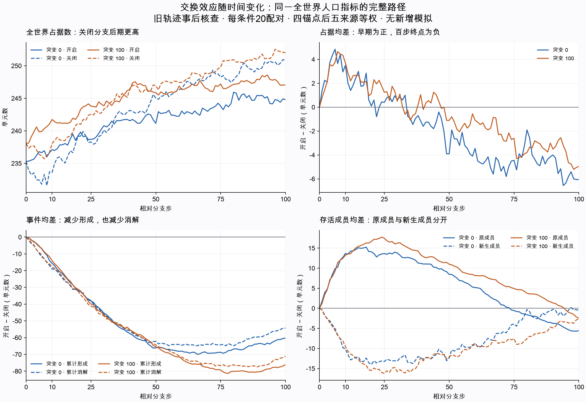

# Study012补充：全世界人口优势从早期转为百步终点劣势

全部80条长分支、8,000步已由事件更新和身份集合差分两条路线完整核对。开启交换在第10步的全世界占据数平均多3.50/3.70个单元，到第100步却分别少6.05/4.95个（突变0/100）。十个来源的终点均差全部为负，但每条件仍有一个单独配对为正、两个为零，不能说每个配对都下降。

这是同一全世界人口指标在既有长分支中的时间变化，与[study013](v4-study-013.zh-CN.md)每步重置的条件一步效应不同。两者也都不能直接替代原study012的局部组件谱系存活比例。

图中每条线先对每来源四锚点等权，再对每条件五来源等权；包含全部相对步0..100。虚实线的含义见各图例，未绘制置信区间，也不把相邻时点当作独立重复。

## 固定事后范围

[方案](../design/v4-population-paths-supplement.md)于`35dc078`固定：study012全部10低输入来源、四锚点、交换开启/关闭各100步，共80分支、40配对。保留全世界所有单元，未按局部多成员组件资格筛选；正文时点1/10/25/50/100预先固定，全部101个初态/后续时点保存在归档中。没有新增模拟、随机种子或独立来源。

40个首步配对的完整物理记录和人口计数与study013相同来源的101/201/301/401步逐项一致，属于已见对照复核。这40个时点的平均不必等于study013全部4,000时点的平均；不能将长分支与逐步重置差直接相减解释成反馈的因果份额。

## 预定时点的世界占据

| 突变 | 分支步 | 开启平均 | 关闭平均 | 开启−关闭 | 正/零/负配对数 |
| --- | ---: | ---: | ---: | ---: | --- |
| 0 | 1 | 235.35 | 233.95 | 1.40 | 13/7/0 |
| 0 | 10 | 237.10 | 233.60 | 3.50 | 15/4/1 |
| 0 | 25 | 238.70 | 238.30 | 0.40 | 12/1/7 |
| 0 | 50 | 241.15 | 245.05 | -3.90 | 4/1/15 |
| 0 | 100 | 244.80 | 250.85 | -6.05 | 1/2/17 |
| 100 | 1 | 238.15 | 237.35 | 0.80 | 11/9/0 |
| 100 | 10 | 241.75 | 238.05 | 3.70 | 17/1/2 |
| 100 | 25 | 243.80 | 242.55 | 1.25 | 12/1/7 |
| 100 | 50 | 245.85 | 246.95 | -1.10 | 10/1/9 |
| 100 | 100 | 247.05 | 252.00 | -4.95 | 1/2/17 |

每条件20配对。百步终点唯一正配对分别为：突变0、种子96001、锚点400，差+2；突变100、种子96002、锚点200，差+1。所有其他正零负结果保存在完整配对路径中。

## 人口账本解释

所有分支、所有时点满足：占据数＝初态人数＋累计形成−累计消解；占据数＝原成员仍存活＋新生后仍存活。后一类只包含分支启动后出生且仍活着的单元，不等于累计出生，也不等于独立谱系数。同一位置死亡后再出生分别计数，不能由占据数不变推断没有事件。

下表为开启−关闭的来源等权均差，事件列为截至该步的累计计数。

| 突变 | 步 | 累计形成差 | 累计消解差 | 原成员存活差 | 新生存活差 |
| --- | ---: | ---: | ---: | ---: | ---: |
| 0 | 1 | -0.40 | -1.80 | 1.80 | -0.40 |
| 0 | 10 | -15.60 | -19.10 | 13.65 | -10.15 |
| 0 | 25 | -37.95 | -38.35 | 13.65 | -13.25 |
| 0 | 50 | -66.10 | -62.20 | 8.45 | -12.35 |
| 0 | 100 | -60.30 | -54.25 | -5.55 | -0.50 |
| 100 | 1 | -0.45 | -1.25 | 1.25 | -0.45 |
| 100 | 10 | -13.95 | -17.65 | 13.25 | -9.55 |
| 100 | 25 | -39.95 | -41.20 | 17.45 | -16.20 |
| 100 | 50 | -65.45 | -64.35 | 11.00 | -12.10 |
| 100 | 100 | -76.10 | -71.15 | -2.40 | -2.55 |

到第100步，两条件都仍然是形成更少、消解也更少，但形成减少量超过消解减少量，世界占据因而更低。原成员存活差从早期为正转为终点平均为负，说明同状态的一步保护不能保证沿不同状态长轨迹的百步保护。这里是已核对的计数解释，尚未隔离输入接受、布局、材料表达等各反馈环节。

原study012报告的“组件内原成员保留比例”均差为正，而这里全世界原成员存活人数均差为负，两者并不矛盾：前者只含初态局部多成员组件，并在组件内按原人数归一化后平均；后者包含初始单例等全世界单元且按人数计数。不能混用范围和权重；后续将从既有组件账本核对这部分构成差异。

## 全部来源的百步均差

每来源四锚点等权，不筛掉反向单配对。

| 种子 | 突变 | 占据差 | 累计形成差 | 累计消解差 | 原成员存活差 | 新生存活差 |
| --- | ---: | ---: | ---: | ---: | ---: | ---: |
| 96000 | 0 | -7.75 | -70.50 | -62.75 | -10.75 | 3.00 |
| 96000 | 100 | -7.25 | -78.25 | -71.00 | -5.25 | -2.00 |
| 96001 | 0 | -3.75 | -69.75 | -66.00 | -2.25 | -1.50 |
| 96001 | 100 | -9.00 | -66.50 | -57.50 | -7.00 | -2.00 |
| 96002 | 0 | -6.00 | -53.00 | -47.00 | -9.50 | 3.50 |
| 96002 | 100 | -3.25 | -50.25 | -47.00 | -5.50 | 2.25 |
| 96003 | 0 | -3.25 | -61.25 | -58.00 | 1.00 | -4.25 |
| 96003 | 100 | -2.25 | -85.25 | -83.00 | -1.75 | -0.50 |
| 96004 | 0 | -9.50 | -47.00 | -37.50 | -6.25 | -3.25 |
| 96004 | 100 | -3.00 | -100.25 | -97.25 | 7.50 | -10.50 |

## 核验与复现

干净执行提交`7c4c62fb27c21b6b1ca29656a191ec28a78d7004`。840项输入绑定前后不变，包含两项原研究的完整固定来源和代码清单、80分支载荷、40首步复用所需study013记录；本地输出2,696,063字节。独立人口算法从身份集合差分复算8,000步，另核对原事件、共同历史初态、完整配对和精确层级均值。两路共享的来源助手不包含人口分类或汇总逻辑。

完整429项测试通过（22.746秒），新增五项覆盖同位死亡出生、身份复活、完整网格与反向来源精确均值、遗漏来源清单；四个计算文件编译通过。额外审查任务受工具数量限制，本补充的两套算法均由主任务编写并inline审查，不能称为不同作者的独立审查。保存记录的双路线复算与独立作者审查是不同保证。

精简证据：[元数据](results/v4-study-012-population-paths-metadata.json)、[80分支全路径](results/v4-study-012-population-paths-branches.json)、[40配对及来源/条件全路径](results/v4-study-012-population-paths-summary.json)、[双路线核验](results/v4-study-012-population-paths-independent-verification.json)。图另附[SVG](figures/v4-study-012-population-paths.svg)和[绘图来源哈希](figures/v4-study-012-population-paths-metadata.json)。既有原始物理载荷仍在本地忽略目录，精简归档不能替代它们。

完整历史数据存在、工作树干净且输出目录不存在时，运行`python -m scripts.analyze_v4_population_paths`及`python -m scripts.verify_v4_population_paths`。绘图可单独运行`python -m scripts.plot_v4_population_paths`，需要可选Matplotlib及中文字体，不影响模拟依赖。

人口更多不是生命、结构复制或适应的充分证据。下一步核对初始组件类别与计权方式对原成员保留指标的影响，继续使用已有全队列，不为追求正结果改变规则或样本。
