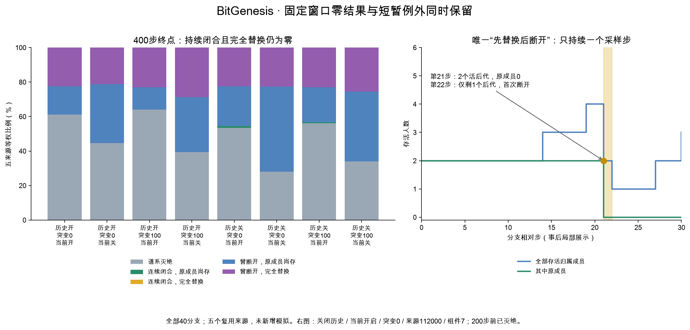

# Study016补充：完整组件结局与首次事件次序

全量独立重建发现一个固定检查点之间的短暂正例：关闭历史、当前开启交换、来源112000、突变0的初始组件7（原成员8、9），第21步已完全替换且此前全程闭合；第22步缩为单个后代，连续闭合随即失效。它在100步仍有4个活后代，到200步已灭绝。这不满足预定100/200/300/400步终点主要判据，但必须保留：终点均零不表示过程中从未短暂满足过该材料/祖源组合。

在1,648条合格组件分支轨迹中，693条曾发生完全替换：685条先断开、7条在同一采样步断开并替换、1条先替换后断开；没有“只替换而始终未断开”。693条中306条在替换后又灭绝，终点仍存活的已替换谱系为387条。400步完整结局为灭绝790、连续且原成员尚存3、连续且完全替换0、断开且原成员尚存468、断开且完全替换387。上述是重复使用824初始配对组件的轨迹计数，不是1,648个独立随机样本。

这是一项已知主要零结果后的描述分解，没有新增模拟或独立来源。短暂正例只持续一个final采样步，不能升级为稳定自我维持或群体复制，也不据此改变原固定窗口或追逐更长正例。

## 方法与边界

[方案](../design/v4-horizon-fates.zh-CN.md)在`3792aa5`冻结；明确是在已知主研究零结果后的探索性分析。执行提交`fd8cd19c33842fb515817c36e7611290d84f2091`，用时98.595秒。复用五来源、两历史、两突变、当前两开关，同一锚点的100/200/300/400检查点。至少2成员且非全世界的初始材料组件才合格。

“灭绝”没有存活原成员或后代，不能计作替换。“完全替换”需仍有活后代且无原成员。“断开”指此前至少一个final采样状态不再closed_multi；终点重新闭合不能恢复连续性。首次事件时间均是分支相对步1–400，同一步内无法判断事件先后。曾替换后又灭绝的组件，终点归灭绝、首替换仍保留。

先逐来源计算比例，再五来源等权；不开关之间合并分母替代来源均值。下表另列原始计数便于复核。历史间初始组件不同，不把它们逐组件配对。

## 400步全部分支合并计数（不是来源等权估计量）

| 历史 | 突变 | 当前交换 | 分母 | 灭绝 | 连续且原成员尚存 | 连续且已完全替换 | 断开且原成员尚存 | 断开且已完全替换 |
| --- | ---: | --- | ---: | ---: | ---: | ---: | ---: | ---: |
| 开 | 0 | 开 | 215 | 132 | 0 | 0 | 35 | 48 |
| 开 | 0 | 关 | 215 | 96 | 0 | 0 | 74 | 45 |
| 开 | 100 | 开 | 223 | 143 | 0 | 0 | 29 | 51 |
| 开 | 100 | 关 | 223 | 88 | 0 | 0 | 71 | 64 |
| 关 | 0 | 开 | 191 | 101 | 2 | 0 | 45 | 43 |
| 关 | 0 | 关 | 191 | 54 | 0 | 0 | 95 | 42 |
| 关 | 100 | 开 | 195 | 110 | 1 | 0 | 40 | 44 |
| 关 | 100 | 关 | 195 | 66 | 0 | 0 | 79 | 50 |

## 400步五来源等权比例（%）

| 历史 | 突变 | 当前交换 | 灭绝 | 连续且原成员尚存 | 连续且已完全替换 | 断开且原成员尚存 | 断开且已完全替换 |
| --- | ---: | --- | ---: | ---: | ---: | ---: | ---: |
| 开 | 0 | 开 | 61.221 | 0.000 | 0.000 | 16.325 | 22.454 |
| 开 | 0 | 关 | 44.637 | 0.000 | 0.000 | 34.239 | 21.123 |
| 开 | 100 | 开 | 64.027 | 0.000 | 0.000 | 12.964 | 23.009 |
| 开 | 100 | 关 | 39.439 | 0.000 | 0.000 | 31.790 | 28.770 |
| 关 | 0 | 开 | 53.455 | 0.975 | 0.000 | 23.125 | 22.444 |
| 关 | 0 | 关 | 27.967 | 0.000 | 0.000 | 49.365 | 22.668 |
| 关 | 100 | 开 | 56.211 | 0.488 | 0.000 | 20.371 | 22.930 |
| 关 | 100 | 关 | 33.994 | 0.000 | 0.000 | 40.422 | 25.584 |

## 四检查点的当前开启−关闭均差（百分点）

| 历史 | 突变 | 相对步 | 灭绝 | 连续且原成员尚存 | 连续且已完全替换 | 断开且原成员尚存 | 断开且已完全替换 |
| --- | ---: | ---: | ---: | ---: | ---: | ---: | ---: |
| 开 | 0 | 100 | 2.564 | 1.340 | 0.000 | -0.606 | -3.299 |
| 开 | 0 | 200 | 11.336 | 0.435 | 0.000 | -9.968 | -1.803 |
| 开 | 0 | 300 | 13.555 | 0.000 | 0.000 | -14.617 | 1.063 |
| 开 | 0 | 400 | 16.583 | 0.000 | 0.000 | -17.915 | 1.331 |
| 开 | 100 | 100 | 9.368 | 0.899 | 0.000 | -8.014 | -2.253 |
| 开 | 100 | 200 | 16.999 | 0.444 | 0.000 | -14.785 | -2.658 |
| 开 | 100 | 300 | 21.909 | 0.000 | 0.000 | -15.704 | -6.205 |
| 开 | 100 | 400 | 24.588 | 0.000 | 0.000 | -18.827 | -5.761 |
| 关 | 0 | 100 | 9.402 | 4.600 | 0.000 | -16.020 | 2.018 |
| 关 | 0 | 200 | 16.723 | 0.855 | 0.000 | -17.624 | 0.046 |
| 关 | 0 | 300 | 21.263 | 1.488 | 0.000 | -23.290 | 0.539 |
| 关 | 0 | 400 | 25.488 | 0.975 | 0.000 | -26.240 | -0.224 |
| 关 | 100 | 100 | 9.838 | 4.120 | 0.000 | -4.426 | -9.532 |
| 关 | 100 | 200 | 15.413 | 0.953 | 0.000 | -7.516 | -8.850 |
| 关 | 100 | 300 | 18.971 | 0.488 | 0.000 | -13.736 | -5.723 |
| 关 | 100 | 400 | 22.217 | 0.488 | 0.000 | -20.051 | -2.654 |

## 所有来源400步配对差（百分点）

| 历史 | 来源 | 突变 | 灭绝 | 连续且原成员尚存 | 连续且已完全替换 | 断开且原成员尚存 | 断开且已完全替换 |
| --- | --- | ---: | ---: | ---: | ---: | ---: | ---: |
| 开 | 112000 | 0 | 17.500 | 0.000 | 0.000 | -27.500 | 10.000 |
| 开 | 112000 | 100 | 25.581 | 0.000 | 0.000 | -18.605 | -6.977 |
| 开 | 112001 | 0 | 17.647 | 0.000 | 0.000 | -17.647 | 0.000 |
| 开 | 112001 | 100 | 35.556 | 0.000 | 0.000 | -20.000 | -15.556 |
| 开 | 112002 | 0 | 19.565 | 0.000 | 0.000 | -23.913 | 4.348 |
| 开 | 112002 | 100 | 11.111 | 0.000 | 0.000 | -8.889 | -2.222 |
| 开 | 112003 | 0 | 12.821 | 0.000 | 0.000 | -7.692 | -5.128 |
| 开 | 112003 | 100 | 15.909 | 0.000 | 0.000 | -22.727 | 6.818 |
| 开 | 112004 | 0 | 15.385 | 0.000 | 0.000 | -12.821 | -2.564 |
| 开 | 112004 | 100 | 34.783 | 0.000 | 0.000 | -23.913 | -10.870 |
| 关 | 112000 | 0 | 39.394 | 0.000 | 0.000 | -15.152 | -24.242 |
| 关 | 112000 | 100 | 23.684 | 0.000 | 0.000 | -10.526 | -13.158 |
| 关 | 112001 | 0 | 10.870 | 2.174 | 0.000 | -19.565 | 6.522 |
| 关 | 112001 | 100 | 30.233 | 0.000 | 0.000 | -18.605 | -11.628 |
| 关 | 112002 | 0 | 21.622 | 2.703 | 0.000 | -18.919 | -5.405 |
| 关 | 112002 | 100 | 14.634 | 2.439 | 0.000 | -21.951 | 4.878 |
| 关 | 112003 | 0 | 22.222 | 0.000 | 0.000 | -41.667 | 19.444 |
| 关 | 112003 | 100 | 30.769 | 0.000 | 0.000 | -25.641 | -5.128 |
| 关 | 112004 | 0 | 33.333 | 0.000 | 0.000 | -35.897 | 2.564 |
| 关 | 112004 | 100 | 11.765 | 0.000 | 0.000 | -23.529 | 11.765 |

## 首次断开状态：五来源等权比例（%）

| 历史 | 突变 | 当前交换 | extinct | fragmented | mixed | closed_singleton | never |
| --- | ---: | --- | ---: | ---: | ---: | ---: | ---: |
| 开 | 0 | 开 | 0.827 | 43.327 | 29.214 | 26.632 | 0.000 |
| 开 | 0 | 关 | 0.827 | 46.776 | 21.337 | 31.060 | 0.000 |
| 开 | 100 | 开 | 1.798 | 39.882 | 32.713 | 25.607 | 0.000 |
| 开 | 100 | 关 | 1.354 | 45.342 | 25.062 | 28.242 | 0.000 |
| 关 | 0 | 开 | 1.162 | 33.769 | 35.941 | 28.153 | 0.975 |
| 关 | 0 | 关 | 0.000 | 38.365 | 37.449 | 24.186 | 0.000 |
| 关 | 100 | 开 | 0.526 | 37.070 | 37.789 | 24.126 | 0.488 |
| 关 | 100 | 关 | 0.000 | 40.394 | 31.692 | 27.914 | 0.000 |

## 首次断开时间区间：五来源等权比例（%）

| 历史 | 突变 | 当前交换 | 001-100 | 101-200 | 201-300 | 301-400 | never |
| --- | ---: | --- | ---: | ---: | ---: | ---: | ---: |
| 开 | 0 | 开 | 98.660 | 0.905 | 0.435 | 0.000 | 0.000 |
| 开 | 0 | 关 | 100.000 | 0.000 | 0.000 | 0.000 | 0.000 |
| 开 | 100 | 开 | 98.646 | 0.910 | 0.444 | 0.000 | 0.000 |
| 开 | 100 | 关 | 99.545 | 0.455 | 0.000 | 0.000 | 0.000 |
| 关 | 0 | 开 | 92.366 | 5.711 | 0.435 | 0.513 | 0.975 |
| 关 | 0 | 关 | 96.966 | 1.966 | 1.068 | 0.000 | 0.000 |
| 关 | 100 | 开 | 93.199 | 4.671 | 1.642 | 0.000 | 0.488 |
| 关 | 100 | 关 | 97.319 | 1.504 | 1.176 | 0.000 | 0.000 |

## 首次完全替换时间区间：五来源等权比例（%）

| 历史 | 突变 | 当前交换 | 001-100 | 101-200 | 201-300 | 301-400 | never |
| --- | ---: | --- | ---: | ---: | ---: | ---: | ---: |
| 开 | 0 | 开 | 27.869 | 8.976 | 4.584 | 4.202 | 54.369 |
| 开 | 0 | 关 | 38.599 | 2.878 | 0.000 | 1.460 | 57.062 |
| 开 | 100 | 开 | 34.116 | 9.923 | 0.910 | 4.032 | 51.019 |
| 开 | 100 | 关 | 37.359 | 4.972 | 0.879 | 1.344 | 55.445 |
| 关 | 0 | 开 | 23.371 | 7.187 | 5.249 | 4.032 | 60.161 |
| 关 | 0 | 关 | 20.485 | 5.797 | 2.662 | 0.870 | 70.185 |
| 关 | 100 | 开 | 22.369 | 10.053 | 7.251 | 5.735 | 54.592 |
| 关 | 100 | 关 | 28.936 | 6.823 | 1.518 | 1.001 | 61.722 |

## 首次事件次序：五来源等权比例（%）

| 历史 | 突变 | 当前交换 | neither | break_only | replacement_only | break_first | same_tick | replacement_first |
| --- | ---: | --- | ---: | ---: | ---: | ---: | ---: | ---: |
| 开 | 0 | 开 | 0.000 | 54.369 | 0.000 | 45.631 | 0.000 | 0.000 |
| 开 | 0 | 关 | 0.000 | 57.062 | 0.000 | 42.046 | 0.892 | 0.000 |
| 开 | 100 | 开 | 0.000 | 51.019 | 0.000 | 48.981 | 0.000 | 0.000 |
| 开 | 100 | 关 | 0.000 | 55.445 | 0.000 | 43.665 | 0.889 | 0.000 |
| 关 | 0 | 开 | 0.975 | 59.186 | 0.000 | 39.233 | 0.000 | 0.606 |
| 关 | 0 | 关 | 0.000 | 70.185 | 0.000 | 29.815 | 0.000 | 0.000 |
| 关 | 100 | 开 | 0.488 | 54.104 | 0.000 | 44.895 | 0.513 | 0.000 |
| 关 | 100 | 关 | 0.000 | 61.722 | 0.000 | 37.286 | 0.991 | 0.000 |

状态中fragmented为后代分属多个材料组件；mixed为单个目标材料组件混入外来成员；closed_singleton仅剩一个后代；never为400步内未断开。次序中neither为两事件均无，break_only仅断开，replacement_only仅替换，break_first断开先，same_tick同一步，replacement_first替换先。表中的替换不要求此前或当时材料闭合。

## 短暂正例的核对范围

“替换先于断开”的唯一记录来自预先固定的全量事件次序分类，未新增筛选标准。另对该记录事后读取20/21/22步作针对性核对：第21步有2个活后代、原成员0且连续；第22步只剩1个后代并首次断开。该针对性核对用于解释全量分析发现，不计作预先冻结的新增检查点或独立实验。

## 核验与可复核文件

生产路线使用既有组件记录并提取首断开观察；独立路线从16,000条已保存的每步身份/材料分组及父链同步重建活后代与原成员数，核对四检查点和全部分类、首事件及统计。所有1,613绑定输入前后不变，进程退出0。完整工程测试494项通过（25.063秒），正式执行前实现未变。
- [metadata](results/v4-study-016-fates-metadata.json)
- [records](results/v4-study-016-fates-records.json)
- [results](results/v4-study-016-fates-results.json)
- [summary](results/v4-study-016-fates-summary.json)
- [independent-verification](results/v4-study-016-fates-independent-verification.json)

精确分数、每分支分母、全部首事件类别配对差和有效/缺失数见归档。所有正文cell/group指标均5/5来源有效、缺失0。四检查点不是新来源；本项不重复计为新实验、功能性自我维持或群体复制。

后续[个案能量与身份账本](v4-study-016-transient.zh-CN.md)已精确定位开启支123步灭绝、关闭支22步灭绝，并确认21步两个后代均来自原成员8、实际交互与步末材料分组不同。
