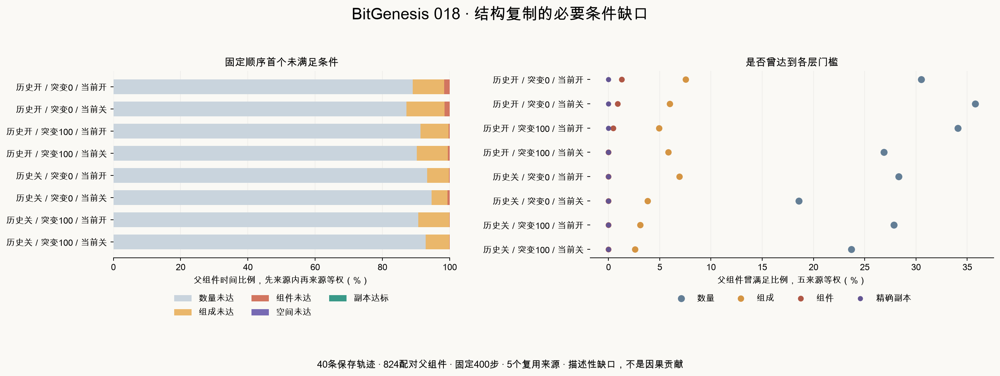

# Study018：结构复制候选的必要条件缺口

完整双路线核验后，1,648条父组件分支记录中，467条曾有至少双倍活成员，84条曾具备双份初始材料与完整程序，6条曾形成两个属性组成相符的完整纯祖源组件，精确空间副本仍为0。连续10步对应338、38、1、0；这些嵌套记录并非独立样本。

全部659,200个父组件采样步中，按固定顺序的首个未满足条件计：数量600,781步、组成54,257步、完整组件4,092步、精确空间匹配70步，全部达标0步。这是合并计数，不是来源等权估计量。数量不足最常见，但并非每个状态都只缺数量；6条轨迹已达到组成相符的完整组件层仍未匹配空间结构。

## 范围与解释

[协议](../../experiments/v4/study-018.md)在`559c59b`冻结；干净执行提交`6c7010caa16fbaece0d104ada1101f1c1050ccc5`，用时122.751秒。复用study016完整40条400步轨迹、824配对初始父组件；新增模拟0、新增独立来源0，重复使用5来源。这是已知study017遗传双副本全零后的探索性描述，不是独立复制实验。

四层依次为：后代及原成员活数量≥2n；每种初始(material,完整program)类型活数量≥初始的两倍；至少两个完整纯祖源材料组件各自属性直方图等于父组件；至少两个完整组件精确周期平移匹配。前两层包含混合组件内的目标祖源成员，第三层要求完整纯祖源组件。额外类型不阻碍库存层，但不能凑入完整相等的组件。

四层每步嵌套。八事件量分别是曾满足和连续至少10步；主要描述量为“组件曾”，不等于复制。五互斥时间状态按固定门槛顺序取首个未满足条件，最后一类为全部满足；这不是时间顺序的首次事件，也不是因果贡献或移除限制后的成功概率。

状态比例先按每父组件400步计算，再父组件等权，再五来源等权；事件按初始父组件二值计算，再来源等权。不可将每个保存步、区间或父组件视为独立随机来源。历史之间初态不同，不逐父组件配对。

## 合并父组件事件计数（不是来源等权估计量）

| 历史 | 突变 | 当前 | 每臂分母 | 数量曾 | 数量10 | 组成曾 | 组成10 | 组件曾 | 组件10 | 副本曾 | 副本10 |
| --- | --- | --- | --- | --- | --- | --- | --- | --- | --- | --- | --- |
| 开 | 0 | 开 | 215 | 65 | 56 | 16 | 13 | 3 | 1 | 0 | 0 |
| 开 | 0 | 关 | 215 | 76 | 49 | 13 | 7 | 2 | 0 | 0 | 0 |
| 开 | 100 | 开 | 223 | 76 | 50 | 11 | 3 | 1 | 0 | 0 | 0 |
| 开 | 100 | 关 | 223 | 60 | 40 | 13 | 6 | 0 | 0 | 0 | 0 |
| 关 | 0 | 开 | 191 | 55 | 41 | 13 | 3 | 0 | 0 | 0 | 0 |
| 关 | 0 | 关 | 191 | 35 | 25 | 7 | 3 | 0 | 0 | 0 | 0 |
| 关 | 100 | 开 | 195 | 54 | 46 | 6 | 3 | 0 | 0 | 0 | 0 |
| 关 | 100 | 关 | 195 | 46 | 31 | 5 | 0 | 0 | 0 | 0 | 0 |

## 合并父组件时间状态计数（不是独立样本量）

| 历史 | 突变 | 当前 | 父组件步数 | 数量未达 | 组成未达 | 组件未达 | 空间未达 | 副本达标 |
| --- | --- | --- | --- | --- | --- | --- | --- | --- |
| 开 | 0 | 开 | 86000 | 76794 | 7797 | 1373 | 36 | 0 |
| 开 | 0 | 关 | 86000 | 75014 | 9736 | 1222 | 28 | 0 |
| 开 | 100 | 开 | 89200 | 81488 | 7435 | 271 | 6 | 0 |
| 开 | 100 | 关 | 89200 | 80423 | 8269 | 508 | 0 | 0 |
| 关 | 0 | 开 | 76400 | 71333 | 4915 | 152 | 0 | 0 |
| 关 | 0 | 关 | 76400 | 72487 | 3499 | 414 | 0 | 0 |
| 关 | 100 | 开 | 78000 | 70894 | 6996 | 110 | 0 | 0 |
| 关 | 100 | 关 | 78000 | 72348 | 5610 | 42 | 0 | 0 |

## 五来源等权事件比例（%）

| 历史 | 突变 | 当前 | 数量曾 | 数量10 | 组成曾 | 组成10 | 组件曾 | 组件10 | 副本曾 | 副本10 |
| --- | --- | --- | --- | --- | --- | --- | --- | --- | --- | --- |
| 开 | 0 | 开 | 30.505 | 26.342 | 7.538 | 6.012 | 1.297 | 0.513 | 0.000 | 0.000 |
| 开 | 0 | 关 | 35.791 | 23.094 | 5.960 | 3.323 | 0.892 | 0.000 | 0.000 | 0.000 |
| 开 | 100 | 开 | 34.098 | 22.485 | 4.922 | 1.343 | 0.444 | 0.000 | 0.000 | 0.000 |
| 开 | 100 | 关 | 26.880 | 17.877 | 5.821 | 2.698 | 0.000 | 0.000 | 0.000 | 0.000 |
| 关 | 0 | 开 | 28.294 | 20.993 | 6.904 | 1.687 | 0.000 | 0.000 | 0.000 | 0.000 |
| 关 | 0 | 关 | 18.571 | 13.393 | 3.819 | 1.725 | 0.000 | 0.000 | 0.000 | 0.000 |
| 关 | 100 | 开 | 27.839 | 23.900 | 3.093 | 1.527 | 0.000 | 0.000 | 0.000 | 0.000 |
| 关 | 100 | 关 | 23.708 | 15.956 | 2.580 | 0.000 | 0.000 | 0.000 | 0.000 | 0.000 |

## 当前开启−关闭事件均差（百分点）

| 历史 | 突变 | 数量曾 | 数量10 | 组成曾 | 组成10 | 组件曾 | 组件10 | 副本曾 | 副本10 |
| --- | --- | --- | --- | --- | --- | --- | --- | --- | --- |
| 开 | 0 | -5.286 | 3.249 | 1.578 | 2.689 | 0.405 | 0.513 | 0.000 | 0.000 |
| 开 | 100 | 7.217 | 4.608 | -0.899 | -1.354 | 0.444 | 0.000 | 0.000 | 0.000 |
| 关 | 0 | 9.723 | 7.601 | 3.085 | -0.038 | 0.000 | 0.000 | 0.000 | 0.000 |
| 关 | 100 | 4.131 | 7.944 | 0.513 | 1.527 | 0.000 | 0.000 | 0.000 | 0.000 |

## 全部20来源配对事件差（百分点）

| 历史 | 来源 | 突变 | 每臂分母 | 数量曾 | 数量10 | 组成曾 | 组成10 | 组件曾 | 组件10 | 副本曾 | 副本10 |
| --- | --- | --- | --- | --- | --- | --- | --- | --- | --- | --- | --- |
| 开 | 112000 | 0 | 40 | 0.000 | 12.500 | 7.500 | 5.000 | -2.500 | 0.000 | 0.000 | 0.000 |
| 开 | 112000 | 100 | 43 | 13.953 | 13.953 | 0.000 | -2.326 | 0.000 | 0.000 | 0.000 | 0.000 |
| 开 | 112001 | 0 | 51 | -1.961 | 1.961 | 0.000 | 5.882 | 1.961 | 0.000 | 0.000 | 0.000 |
| 开 | 112001 | 100 | 45 | 4.444 | 2.222 | 0.000 | 0.000 | 0.000 | 0.000 | 0.000 | 0.000 |
| 开 | 112002 | 0 | 46 | -6.522 | 4.348 | -2.174 | 0.000 | 0.000 | 0.000 | 0.000 | 0.000 |
| 开 | 112002 | 100 | 45 | 0.000 | 6.667 | -2.222 | 0.000 | 2.222 | 0.000 | 0.000 | 0.000 |
| 开 | 112003 | 0 | 39 | -2.564 | 5.128 | 2.564 | 2.564 | 0.000 | 0.000 | 0.000 | 0.000 |
| 开 | 112003 | 100 | 44 | 6.818 | 4.545 | -2.273 | -2.273 | 0.000 | 0.000 | 0.000 | 0.000 |
| 开 | 112004 | 0 | 39 | -15.385 | -7.692 | 0.000 | 0.000 | 2.564 | 2.564 | 0.000 | 0.000 |
| 开 | 112004 | 100 | 46 | 10.870 | -4.348 | 0.000 | -2.174 | 0.000 | 0.000 | 0.000 | 0.000 |
| 关 | 112000 | 0 | 33 | -3.030 | -3.030 | 3.030 | -3.030 | 0.000 | 0.000 | 0.000 | 0.000 |
| 关 | 112000 | 100 | 38 | 0.000 | 0.000 | 0.000 | 2.632 | 0.000 | 0.000 | 0.000 | 0.000 |
| 关 | 112001 | 0 | 46 | 17.391 | 17.391 | 4.348 | 0.000 | 0.000 | 0.000 | 0.000 | 0.000 |
| 关 | 112001 | 100 | 43 | 2.326 | 0.000 | 0.000 | 0.000 | 0.000 | 0.000 | 0.000 | 0.000 |
| 关 | 112002 | 0 | 37 | 5.405 | 2.703 | 2.703 | 5.405 | 0.000 | 0.000 | 0.000 | 0.000 |
| 关 | 112002 | 100 | 41 | 7.317 | 12.195 | 0.000 | 2.439 | 0.000 | 0.000 | 0.000 | 0.000 |
| 关 | 112003 | 0 | 36 | 8.333 | 5.556 | 2.778 | 0.000 | 0.000 | 0.000 | 0.000 | 0.000 |
| 关 | 112003 | 100 | 39 | 5.128 | 12.821 | 2.564 | 2.564 | 0.000 | 0.000 | 0.000 | 0.000 |
| 关 | 112004 | 0 | 39 | 20.513 | 15.385 | 2.564 | -2.564 | 0.000 | 0.000 | 0.000 | 0.000 |
| 关 | 112004 | 100 | 34 | 5.882 | 14.706 | 0.000 | 0.000 | 0.000 | 0.000 | 0.000 | 0.000 |

## 五来源等权时间状态比例（%）

| 历史 | 突变 | 当前 | 数量未达 | 组成未达 | 组件未达 | 空间未达 | 副本达标 |
| --- | --- | --- | --- | --- | --- | --- | --- |
| 开 | 0 | 开 | 89.016 | 9.316 | 1.626 | 0.043 | 0.000 |
| 开 | 0 | 关 | 87.102 | 11.418 | 1.448 | 0.031 | 0.000 |
| 开 | 100 | 开 | 91.364 | 8.326 | 0.304 | 0.007 | 0.000 |
| 开 | 100 | 关 | 90.176 | 9.249 | 0.575 | 0.000 | 0.000 |
| 关 | 0 | 开 | 93.348 | 6.446 | 0.206 | 0.000 | 0.000 |
| 关 | 0 | 关 | 94.651 | 4.750 | 0.600 | 0.000 | 0.000 |
| 关 | 100 | 开 | 90.706 | 9.155 | 0.139 | 0.000 | 0.000 |
| 关 | 100 | 关 | 92.828 | 7.119 | 0.053 | 0.000 | 0.000 |

## 当前开启−关闭时间状态均差（百分点）

| 历史 | 突变 | 数量未达 | 组成未达 | 组件未达 | 空间未达 | 副本达标 |
| --- | --- | --- | --- | --- | --- | --- |
| 开 | 0 | 1.914 | -2.102 | 0.178 | 0.011 | 0.000 |
| 开 | 100 | 1.188 | -0.923 | -0.272 | 0.007 | 0.000 |
| 关 | 0 | -1.303 | 1.696 | -0.393 | 0.000 | 0.000 |
| 关 | 100 | -2.122 | 2.036 | 0.086 | 0.000 | 0.000 |

## 全部20来源配对时间状态差（百分点）

| 历史 | 来源 | 突变 | 每臂分母 | 数量未达 | 组成未达 | 组件未达 | 空间未达 | 副本达标 |
| --- | --- | --- | --- | --- | --- | --- | --- | --- |
| 开 | 112000 | 0 | 40 | -3.406 | 2.419 | 1.081 | -0.094 | 0.000 |
| 开 | 112000 | 100 | 43 | 1.930 | -1.669 | -0.262 | 0.000 | 0.000 |
| 开 | 112001 | 0 | 51 | 4.745 | -4.941 | 0.201 | -0.005 | 0.000 |
| 开 | 112001 | 100 | 45 | 0.839 | -1.178 | 0.339 | 0.000 | 0.000 |
| 开 | 112002 | 0 | 46 | 2.614 | -2.560 | -0.054 | 0.000 | 0.000 |
| 开 | 112002 | 100 | 45 | -1.122 | 1.294 | -0.206 | 0.033 | 0.000 |
| 开 | 112003 | 0 | 39 | -0.314 | -0.391 | 0.705 | 0.000 | 0.000 |
| 开 | 112003 | 100 | 44 | 0.710 | 0.597 | -1.307 | 0.000 | 0.000 |
| 开 | 112004 | 0 | 39 | 5.929 | -5.038 | -1.045 | 0.154 | 0.000 |
| 开 | 112004 | 100 | 46 | 3.582 | -3.658 | 0.076 | 0.000 | 0.000 |
| 关 | 112000 | 0 | 33 | 1.515 | 0.462 | -1.977 | 0.000 | 0.000 |
| 关 | 112000 | 100 | 38 | -0.803 | 0.579 | 0.224 | 0.000 | 0.000 |
| 关 | 112001 | 0 | 46 | -4.016 | 3.957 | 0.060 | 0.000 | 0.000 |
| 关 | 112001 | 100 | 43 | 4.012 | -3.983 | -0.029 | 0.000 | 0.000 |
| 关 | 112002 | 0 | 37 | -1.993 | 1.459 | 0.534 | 0.000 | 0.000 |
| 关 | 112002 | 100 | 41 | -1.817 | 1.573 | 0.244 | 0.000 | 0.000 |
| 关 | 112003 | 0 | 36 | 0.389 | -0.410 | 0.021 | 0.000 | 0.000 |
| 关 | 112003 | 100 | 39 | -4.583 | 4.583 | 0.000 | 0.000 | 0.000 |
| 关 | 112004 | 0 | 39 | -2.410 | 3.013 | -0.603 | 0.000 | 0.000 |
| 关 | 112004 | 100 | 34 | -7.419 | 7.426 | -0.007 | 0.000 | 0.000 |

## 全部六条组件层达标轨迹

均在开启历史下；下表包含全部partition区间，不只列最长或持续10步者。第397–400步区间右删失；其同一轨迹此前307–320的14步区间完整，不需要延时即可判定持续门槛成立。该层仅匹配属性直方图，不是精确空间副本。

| 来源 | 突变 | 当前交换 | 父组件 | 原成员 | 所有区间 | 最长 | 达标步数 |
| --- | --- | --- | --- | --- | --- | --- | --- |
| 112000 | 0 | 关 | 83 | [121, 133] | 98–103, 120–121, 132–132, 142–147 | 6 | 15 |
| 112001 | 0 | 开 | 51 | [79, 80, 93] | 351–351, 372–376 | 5 | 6 |
| 112001 | 0 | 开 | 55 | [87, 88] | 304–306, 375–377 | 3 | 6 |
| 112001 | 0 | 关 | 51 | [79, 80, 93] | 75–76, 85–87, 94–94, 97–103 | 7 | 13 |
| 112002 | 100 | 开 | 107 | [163, 164] | 48–53 | 6 | 6 |
| 112004 | 0 | 开 | 43 | [65, 66] | 53–56, 63–63, 305–305, 307–320, 397–400 | 14 | 24 |

## 完整性与证据

全部条件/指标的有效、缺失来源数为[(5, 0)]。两条独立新增门槛路线核对16,000保存步、1,648父组件分支、2,636,800布尔值、所有区间、五状态计数及精确统计；1631输入绑定不变。copy直接使用study017已双算法核验的输入序列，本项没有声称再次独立重算空间几何。40分支成功，无删减、无失败。

工程完整回归542项通过25.316秒，17专项通过。跨作者复用上下文审查发现并修复017核验器身份哈希遗漏，内存篡改测试被拒绝，复审通过；未宣称全新上下文审查。

- [metadata](results/v4-study-018-metadata.json)
- [records](results/v4-study-018-records.json)
- [results](results/v4-study-018-results.json)
- [summary](results/v4-study-018-summary.json)
- [independent-verification](results/v4-study-018-independent-verification.json)

这些缺口不证明某项改动足以带来繁殖，也不排除其他环境或程序下的结构复制。V4功能维持、群体遗传和复制标准仍未完成。
